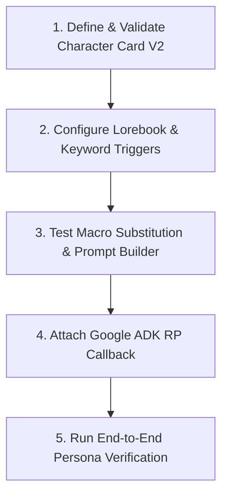

# Character RP Skill

Operational guide and guardrails for authoring, parsing, and rendering Character Card V2 personas, dynamic lorebook world info, macro substitution, and Google ADK roleplay agent callbacks in `story_rp_engine`.

---

## Workflow: Method Ladder

Follow these sequential steps when authoring or debugging character roleplay pipelines:



### 1. Define & Validate Character Card V2
- Author or load character definitions matching `CharacterCard` schema (`char_id`, `name`, `description`, `personality`, `scenario`, `first_mes`, `mes_example`, `post_history_instructions`, `tags`).
- Deserialize using `story_rp_engine.rp.character.load_character_from_json` or `load_character_from_dict`.
- Ensure JSON root is an object and required fields (`char_id`, `name`) are present.
- Consult `references/character-card-v2-spec.md` for full schema specifications and validation error handling.

### 2. Configure Lorebook & Keyword Triggers
- Define `Lorebook` containing `LorebookEntry` items with specific, non-generic `keys`, `content`, and `insertion_order`.
- Set `enabled: True` for active entries.
- Ensure keys are distinct phrases (e.g., `"Silver Order"`, `"Frostpeak"`) rather than common stopwords.
- Consult `references/lorebook-matching-rules.md` for regex rules, whole-word matching, and tiered insertion ordering.

### 3. Test Macro Substitution & Prompt Builder
- Validate case-insensitive replacement of `{{char}}` and `{{user}}` via `replace_macros`.
- Build the combined roleplay system instruction using `story_rp_engine.rp.prompt_builder.build_rp_system_instruction`.
- Verify that sections are assembled in the expected order: Foundation Preamble -> Character -> Scenario -> World Info -> Dialogue Examples -> Directives.

### 4. Attach Google ADK RP Callback
- Connect `rp_before_model_callback` to the ADK `LlmAgent` lifecycle.
- Store `lorebook` and optional `authors_note` inside `callback_context.state`.
- Callback inspects the latest user turn, triggers `LorebookEngine.find_matching_entries`, appends matching lore and Author's Note directives to `llm_request.config.system_instruction`, and returns `None`.

### 5. Run End-to-End Persona Verification
- Instantiate the RP agent via `story_rp_engine.rp.agent.create_rp_agent(card, config, user_name="...")`.
- Run automated unit and integration tests to verify character greeting, instruction generation, lore matching, and callback execution.

---

## Critical Guardrails

1. **Case-Insensitive Macro Replacement**:
   - `{{char}}` and `{{user}}` must be replaced case-insensitively (`{{Char}}`, `{{USER}}`, etc.).
   - Never leave unrendered mustache placeholders in the final system prompt sent to the LLM.
2. **Exact Word Boundary Enforcement**:
   - Lorebook keyword search must strictly apply word boundaries `\b` (`r'\b' + re.escape(key) + r'\b'`).
   - Substring matches (e.g. key `"cat"` triggering on `"caterpillar"`) are strictly prohibited to prevent false positive prompt contamination.
3. **Content Deduplication Across Entries**:
   - When multiple keys in the same entry or across multiple entries match identical content, deduplicate via `seen_contents` to avoid prompt bloating.
4. **Deterministic Insertion Ordering**:
   - Lorebook entries must be sorted by `insertion_order` ascending. High-priority world rules (lower numbers) must precede background lore.
5. **Anti-Fourth-Wall & Speaking-for-User Protection**:
   - System instruction must explicitly instruct the model: *"Do not break the fourth wall or speak for {user_name}."*
6. **Non-Blocking ADK Callback Contract**:
   - `rp_before_model_callback` must always return `None` to allow generation to proceed to the target LLM. Returning an `LlmResponse` intercepts generation prematurely.
7. **Context Window Stewardship for SLMs**:
   - Keep individual lore snippets concise (1–3 sentences, 30–60 tokens). Total active lore should stay under 500 tokens to preserve dialogue context in 2K–8K token SLMs.

---

## Verification Commands

Validate the character roleplay engine and skills:

```bash
# 1. Run agent skills validation for character-rp
uv run pytest tests/test_agent_skills.py -k "character" -v

# 2. Run story RP engine character and lorebook test suites
uv run pytest tests/story_rp_engine/test_character.py tests/story_rp_engine/test_lorebook.py tests/story_rp_engine/test_prompt_builder.py tests/story_rp_engine/test_rp_callbacks.py -v

# 3. Test RP agent creation
uv run pytest tests/story_rp_engine/test_rp_agent.py -v
```

---

## Reference Guides

Deep documentation is available in the 1-level deep references:
- `references/character-card-v2-spec.md`: Complete Character Card V2 JSON specification, Pydantic data models, macro replacement engine, prompt hierarchy, and JSON validation error handling.
- `references/lorebook-matching-rules.md`: Lorebook architecture, whole-word regex matching algorithms, Google ADK `rp_before_model_callback` integration, Author's Note steering, and SLM context budget management.
