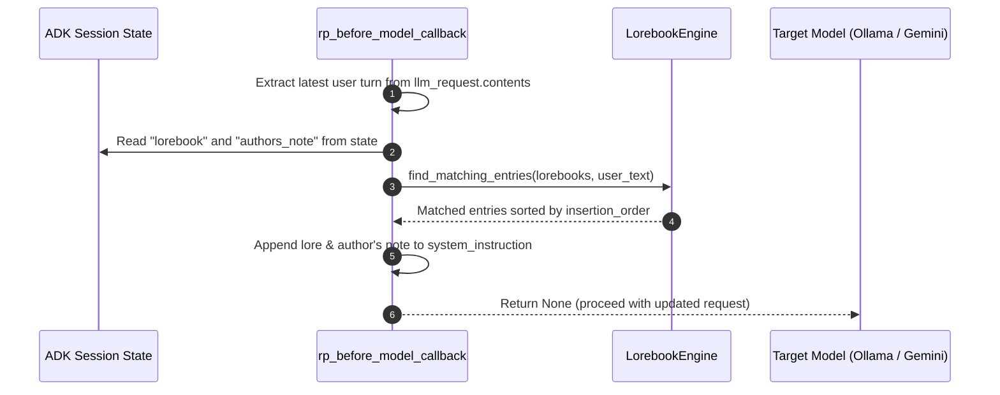

# Lorebook Matching Rules & Dynamic Injection Reference

Comprehensive guide to dynamic lorebook keyword matching, whole-word boundary algorithms, Author's Note steering, and Google ADK callback integration in `story_rp_engine`.

---

## Table of Contents
1. [Overview](#overview)
2. [Data Structures](#data-structures)
3. [Keyword Matching Algorithm](#keyword-matching-algorithm)
4. [Whole-Word Boundary & Regex Semantics](#whole-word-boundary--regex-semantics)
5. [Google ADK Callback Architecture](#google-adk-callback-architecture)
6. [Author's Note Steering](#authors-note-steering)
7. [Selective Recursion & Cascading Matches](#selective-recursion--cascading-matches)
8. [Token Budget Caps & Context Management for SLMs](#token-budget-caps--context-management-for-slms)
9. [Code Implementation & Test Patterns](#code-implementation--test-patterns)

---

## Overview

In interactive storytelling and character roleplay, injecting the entire world bible into the model's context window is inefficient and quickly exhausts Small Language Model (SLM) token limits (2K–8K tokens).

**Lorebooks** (World Info) solve this through **just-in-time dynamic retrieval**:
- Lore entries remain dormant in storage.
- When a user message (or narrative context) mentions relevant keywords, the corresponding lore entries activate.
- Activated snippets are dynamically injected into the system instruction right before LLM inference via Google ADK callbacks.

---

## Data Structures

The data models are defined in `story_rp_engine.core.types`:

### `LorebookEntry`

```python
class LorebookEntry(BaseModel):
    keys: List[str]
    content: str
    insertion_order: int = 100
    enabled: bool = True
```

- **`keys`** (`list[str]`): List of keyword triggers. Case-insensitive. Can be single words (`"dragon"`) or multi-word phrases (`"silver sword"`).
- **`content`** (`str`): The encyclopedic fact, world detail, or NPC backstory injected into the prompt.
- **`insertion_order`** (`int`, default `100`): Sorting weight. Lower numbers are prioritized and appear higher in the injected prompt section.
- **`enabled`** (`bool`, default `True`): Toggles whether the entry participates in keyword evaluation.

### `Lorebook`

```python
class Lorebook(BaseModel):
    name: str
    description: Optional[str] = None
    entries: List[LorebookEntry] = Field(default_factory=list)
```

- **`name`** (`str`): Namespace or title of the lorebook (e.g. `"Faerun_Geography"`, `"Magic_Artifacts"`).
- **`description`** (`Optional[str]`): Human-readable summary of the lorebook's domain.
- **`entries`** (`list[LorebookEntry]`): Array of lore entries contained within this book.

---

## Keyword Matching Algorithm

The matching engine is implemented in `story_rp_engine.rp.lorebook.LorebookEngine.find_matching_entries`:

```python
class LorebookEngine:
    @staticmethod
    def find_matching_entries(lorebooks: List[Lorebook], text: str) -> List[LorebookEntry]:
        if not text or not lorebooks:
            return []

        matched: List[LorebookEntry] = []
        seen_contents = set()

        for book in lorebooks:
            for entry in book.entries:
                if not entry.enabled or entry.content in seen_contents:
                    continue
                for key in entry.keys:
                    stripped_key = key.strip()
                    if not stripped_key:
                        continue
                    pattern = r'\b' + re.escape(stripped_key) + r'\b'
                    if re.search(pattern, text, re.IGNORECASE):
                        matched.append(entry)
                        seen_contents.add(entry.content)
                        break

        # Sort by insertion_order ascending
        matched.sort(key=lambda x: x.insertion_order)
        return matched
```

### Execution Steps:
1. **Input Guard**: If `text` is empty/null or `lorebooks` is empty, return an empty list `[]`.
2. **Enabled Filtering**: Skip entries where `entry.enabled` is `False`.
3. **Content Deduplication**: Maintain `seen_contents = set()`. If multiple entries or multiple keys produce identical `content`, only the first matched entry is retained.
4. **Key Normalization & Regex Search**:
   - Strip leading/trailing whitespace (`key.strip()`).
   - Discard empty or whitespace-only keys (`""`, `"   "`).
   - Construct regex pattern using `re.escape` bounded by word boundaries `\b`.
   - Apply `re.IGNORECASE`.
   - On the first matched key for an entry, immediately append to `matched`, record `entry.content` in `seen_contents`, and `break` key evaluation for that entry.
5. **Deterministic Ordering**: Sort all matched entries by `insertion_order` ascending (e.g. 10 before 25 before 50).

---

## Whole-Word Boundary & Regex Semantics

Word boundary matching (`\b`) is critical to prevent unwanted false positives.

### False Positive Prevention Matrix

| Configured Key | User Input | Match Result | Reason |
| :--- | :--- | :--- | :--- |
| `"cat"` | `"The caterpillar crawled."` | **NO MATCH** | `"cat"` is a substring within `"caterpillar"`, not bounded by `\b`. |
| `"cat"` | `"The leaves scattered."` | **NO MATCH** | `"cat"` is inside `"scattered"`. |
| `"cat"` | `"The cat purred."` | **MATCH** | `"cat"` is surrounded by word boundaries. |
| `"cat"` | `"Watch out for that cat!"` | **MATCH** | Punctuation (`!`) acts as a word boundary. |
| `"silver sword"` | `"He drew his silver sword quietly."` | **MATCH** | Multi-word phrase matches full consecutive tokens. |
| `"Necromancer"` | `"The necromancer cast a spell."` | **MATCH** | `re.IGNORECASE` matches regardless of capitalization. |

### Regex Escaping
All keys pass through `re.escape(stripped_key)` before regex compilation. This guarantees that special regex characters in keys (such as `+`, `*`, `?`, `(`, `)`, `[`, `]`) are treated as literal text and do not cause syntax errors or unintended regex behavior.

---

## Google ADK Callback Architecture

Dynamic injection is handled by `rp_before_model_callback` in `story_rp_engine.rp.callbacks`.

### ADK Request Flow



### Callback Code Structure

```python
def rp_before_model_callback(
    callback_context: CallbackContext,
    llm_request: LlmRequest,
) -> Optional[LlmResponse]:
    # 1. Extract text from the latest user message
    user_text = ""
    if llm_request.contents:
        for content in reversed(llm_request.contents):
            if content.role == "user" and content.parts:
                user_text = " ".join([p.text for p in content.parts if getattr(p, "text", None)])
                break

    extra_sections = []

    # 2. Match Lorebook from session state
    lorebook = callback_context.state.get("lorebook") if callback_context and callback_context.state else None
    if lorebook and user_text:
        lorebooks = [lorebook] if isinstance(lorebook, Lorebook) else list(lorebook)
        active_lore = LorebookEngine.find_matching_entries(lorebooks, user_text)
        if active_lore:
            lore_text = "\n".join([f"- {entry.content}" for entry in active_lore])
            extra_sections.append(f"### Relevant World Information\n{lore_text}")

    # 3. Extract Author's Note from session state
    authors_note = callback_context.state.get("authors_note") if callback_context and callback_context.state else None
    if authors_note and str(authors_note).strip():
        extra_sections.append(f"### Narrative Directive\n{str(authors_note).strip()}")

    # 4. Inject additions into system instruction
    if extra_sections:
        additions = "\n\n".join(extra_sections)
        current_instruction = ""
        if llm_request.config and llm_request.config.system_instruction:
            inst = llm_request.config.system_instruction
            current_instruction = inst if isinstance(inst, str) else str(inst)

        new_instruction = f"{current_instruction}\n\n{additions}".strip()
        if not llm_request.config:
            llm_request.config = types.GenerateContentConfig()
        llm_request.config.system_instruction = new_instruction

    # Always return None so LLM generation proceeds
    return None
```

---

## Author's Note Steering

**Author's Note** (A/N) is a high-priority narrative steering mechanism injected alongside active lore.

### Use Cases:
- **Tone Direction**: `"Maintain a gritty, suspenseful atmosphere with vivid sensory details."`
- **Pacing & Length**: `"Keep dialogue responses under 3 sentences. Emphasize physical actions."`
- **Scene Progression**: `"The storm outside the tower is intensifying; lightning strikes nearby."`
- **Relationship Dynamics**: `"The character suspects the user is concealing a secret."`

### Formatting in Prompt:
When active, the Author's Note is formatted as:
```text
### Narrative Directive
{authors_note text}
```
Placed after `### Relevant World Information` so that stylistic steering takes immediate effect over the generated output.

---

## Selective Recursion & Cascading Matches

In advanced roleplay scenarios, entries can reference other concepts in the world (e.g., an entry on `"The Order of the Silver Dawn"` mentions `"High Inquisitor Malakor"`).

### Recursion Mechanics
1. **Turn 1 (Direct Match)**: User mentions `"Silver Dawn"`. Entry for `"The Order of the Silver Dawn"` is activated.
2. **Turn 1 (Recursive Match)**: The text of `"The Order of the Silver Dawn"` is scanned against other entries. If `"Malakor"` is present in the text, Malakor's entry is also pulled into context.

### Guardrails Against Recursive Runaway:
- **Depth Limit**: Limit recursive scanning to a maximum depth of `1` (or `2`).
- **Cycle Detection**: The `seen_contents` deduplication set prevents circular activation loops (A triggers B triggers A).
- **Token Cap**: Cap the total recursive lore payload to a fixed budget (e.g. 500 tokens).

---

## Token Budget Caps & Context Management for SLMs

Small Language Models (2B–8B parameters) typically operate within a 2,048 or 4,096 token context window. Inefficient lorebook design can cause prompt bloat, pushing out dialogue history.

### Best Practice Token Allocations

| Section | Recommended Token Budget | Notes |
| :--- | :--- | :--- |
| System Persona & Description | 250 – 450 tokens | Character appearance, traits, scenario, directives. |
| Dialogue Examples (`mes_example`) | 150 – 300 tokens | 1–2 brief dialogue exchanges demonstrating cadence. |
| Active Lorebook Entries | 200 – 500 tokens | 2–5 activated entries max. |
| Author's Note | 30 – 80 tokens | Concise, high-impact stylistic steering. |
| Conversation History | 1,000 – 2,500 tokens | Recent user/assistant dialogue turns. |
| Generation Headroom | 256 – 512 tokens | Model completion buffer. |

### Entry Authoring Guidelines:
1. **Brevity**: Write entries in 1 to 3 punchy sentences (30–60 tokens per entry).
2. **Specific Keys**: Avoid overly broad single-word keys like `"the"`, `"he"`, `"man"`, or `"room"`. Use specific names, places, and artifact titles (`"Drakenspire"`, `"Obsidian Blade"`).
3. **Tiered Insertion Order**:
   - `0 - 20`: Core world rules, physical laws, faction treaties.
   - `21 - 50`: Character backstories, important NPCs.
   - `51 - 99`: Locations, cities, geography.
   - `100+`: Minor items, casual trivia.

---

## Code Implementation & Test Patterns

### Unit Test Examples (`pytest`)

```python
from story_rp_engine.core.types import Lorebook, LorebookEntry
from story_rp_engine.rp.lorebook import LorebookEngine

def test_lorebook_matching_and_ordering():
    entry_high = LorebookEntry(keys=["dragon"], content="Dragons breathe fire.", insertion_order=10)
    entry_low = LorebookEntry(keys=["cave"], content="The cave is damp.", insertion_order=50)
    lorebook = Lorebook(name="World", entries=[entry_low, entry_high])

    # Text matches both; high-priority entry appears first
    matched = LorebookEngine.find_matching_entries([lorebook], "A dragon sleeps inside the cave.")
    assert len(matched) == 2
    assert matched[0].content == "Dragons breathe fire."
    assert matched[1].content == "The cave is damp."

def test_lorebook_disabled_entries_ignored():
    entry = LorebookEntry(keys=["secret"], content="Hidden treasure", enabled=False)
    lorebook = Lorebook(name="Secrets", entries=[entry])

    matched = LorebookEngine.find_matching_entries([lorebook], "Tell me the secret.")
    assert len(matched) == 0
```
