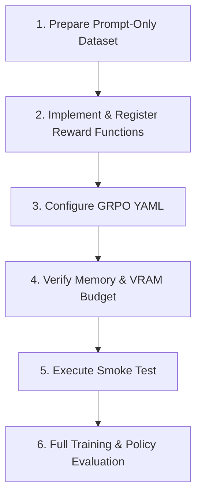

# GRPO Reasoning RL Skill

Operational instructions and guardrails for running Group Relative Policy Optimization (GRPO) online reinforcement learning on Small Language Models (SLMs) using Unsloth, TRL, and custom reward verifiers.

---

## Workflow: Method Ladder

Follow these sequential steps when setting up or modifying GRPO workflows:



### 1. Prepare Prompt-Only Dataset
- Format data with prompt-only rows (`prompt`, `question`, or `problem`) and optional ground truth metadata (`answer`, `solution`, `ground_truth`).
- **Critical rule**: Do not include assistant completions, thinking chains, or pre-solved steps in the prompt; the policy must generate its own reasoning rollouts.
- Dataset is loaded and normalized via `slm_post_train.data.grpo_data.prepare_grpo_dataset`.

### 2. Implement & Register Reward Functions
- Decorate custom verifiers with `@register_reward("name")` from `slm_post_train.rewards.registry`.
- Implement standard signature `(prompts, completions, **kwargs) -> List[float]`.
- Normalize completions using `_extract_text` to handle raw strings or conversational turn dicts.
- Combine format checks (`xml_format`), ground truth verifiers (`exact_match`), or sandboxed execution (`code_execution`).
- Consult `references/reward-functions.md` for complete implementation details and sandbox security rules.

### 3. Configure GRPO YAML
- Create or update a configuration file under `configs/grpo/` (e.g. `configs/grpo/gemma_sudoku_rl.yaml`).
- Set `stage: grpo` at the root level.
- Specify reward names in the `rewards` list matching registry keys.
- Set rollout parameters: `num_generations` (2 to 4), `max_prompt_length`, `max_completion_length`, and `learning_rate` (e.g. `5e-6`).
- Consult `references/grpo-config-schema.md` for parameter definitions and default values.

### 4. Verify Memory & VRAM Budget (<= 8GB VRAM)
- Ensure `load_in_4bit: true` is active for QLoRA.
- Keep `use_gradient_checkpointing: "unsloth"` in the `lora` block.
- Set `num_generations: 2` (or `4`) and `batch_size: 1` with `gradient_accumulation_steps: 2`.
- Cap `max_completion_length` at 256 or 512 tokens to prevent activation KV-cache OOM.
- Set `optim: "paged_adamw_8bit"`.

### 5. Execute Smoke Test
- Always run a 2-step verification smoke test prior to launching long training runs:
  ```bash
  uv run slm-post-train train --config configs/grpo/smoke_test.yaml
  ```
- Check logs for model loading, reward function initialization, rollout generations, and valid loss calculation.

### 6. Full Training & Policy Evaluation
- Launch full training with target task configuration:
  ```bash
  uv run slm-post-train train --config configs/grpo/gemma_sudoku_rl.yaml
  ```
- Monitor reward distribution curves and KL drift using `GRPOMonitorCallback`.
- Exported policy LoRA adapters are saved to `outputs/<output_dir>/`.

---

## Critical Guardrails

1. **Prompt-Only Input Guarantee**:
   - The input dataset must contain ONLY prompts/questions. Never pass pre-populated assistant responses to GRPO training datasets; rollouts must be generated autonomously by the policy.
2. **Reward Function Contract & Determinism**:
   - Reward functions must return a `List[float]` matching `len(completions)` exactly.
   - Rewards should be deterministic and accept `**kwargs` to gracefully handle optional dataset metadata columns (`answer`, `ground_truth`).
3. **The Zero-Variance Trap**:
   - GRPO computes advantage by normalizing rewards within each prompt's generation group:
     $$(r_i - \bar{r}) / (\sigma_r + \epsilon)$$
   - If sampling temperature is 0 or all completions receive identical scores, variance $\sigma_r$ is 0 and advantages vanish to 0, completely stalling learning. Maintain `temperature: 0.7 - 0.9`.
4. **Reward Hacking & Sandboxed Execution**:
   - Structure rewards must enforce non-empty reasoning tags (e.g., `<think>...</think><answer>...</answer>`).
   - Code execution rewards must run in an isolated child process with strict CPU timeouts (e.g. 2s) and restricted `__builtins__` to prevent infinite loops, hangs, or malicious shell invocation.
5. **KL Divergence Monitoring**:
   - Monitor policy drift from the reference model via `beta`. If KL divergence exceeds 0.5, increase `beta` to prevent policy collapse into gibberish or length-bloat hacking.
6. **Data & Artifact Hygiene**:
   - Datasets must reside in `data/` and model outputs in `outputs/`.
   - Never commit raw datasets, model weights, or adapter binaries to version control.

---

## Verification Commands

Validate the GRPO environment, reward registry, and configuration:

```bash
# 1. Verify reward registry imports and registered reward functions
uv run python -c "from slm_post_train.rewards.registry import list_registered_rewards; import slm_post_train.rewards.standard; print(f'Registered rewards: {list_registered_rewards()}')"

# 2. Run agent skills test suite
uv run pytest tests/test_agent_skills.py -k grpo -v

# 3. Non-destructive smoke test (requires GPU or mock environment)
uv run slm-post-train train --config configs/grpo/smoke_test.yaml
```

---

## Reference Guides

Deep documentation is available in the 1-level deep references:
- `references/reward-functions.md`: Architecture of `@register_reward`, built-in verifiers (`xml_format`, `exact_match`, `code_execution`), authoring custom verifiers, reward hacking mitigations, and subprocess sandbox isolation.
- `references/grpo-config-schema.md`: Complete YAML schema, rollout parameters (`num_generations`, `max_completion_length`, `beta`, `temperature`), `GRPOMonitorCallback`, and <=8GB VRAM budgeting.
