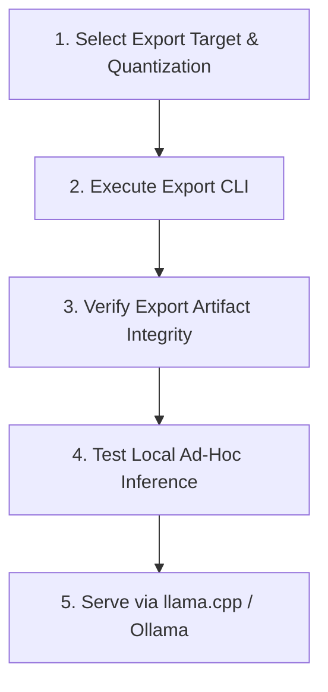

# Model Export & GGUF Quantization Skill

Operational instructions and guardrails for merging trained LoRA adapters, generating standalone 16-bit or 4-bit model checkpoints, quantizing to GGUF binaries, and hosting local inference with llama.cpp or Ollama.

---

## Workflow: Method Ladder

Follow these sequential steps when exporting, quantizing, or serving trained model checkpoints:



### 1. Select Export Target & Quantization
- Determine target runtime requirements:
  - `lora`: Lightweight adapter delta only (~20-150 MB).
  - `merged_16bit`: Standard unquantized float16/bfloat16 Hugging Face model for vLLM, TGI, or HF Hub.
  - `merged_4bit`: 4-bit merged checkpoint for compact disk footprint and quick loading.
  - `gguf`: Quantized binary for edge deployment, llama.cpp, or Ollama.
- For GGUF, select quantization precision:
  - `q4_k_m`: Recommended default; balanced latency, low memory, minimal perplexity loss.
  - `q8_0`: Near-zero loss 8-bit quantization for high-fidelity roleplay/creative generation.
  - `f16`: Unquantized baseline float16 GGUF.
- Consult `references/export-workflows.md` for format comparisons and quantization benchmarks.

### 2. Execute Export CLI
- Run export command via the repository CLI:
  ```bash
  uv run slm-post-train export \
      --model-path outputs/my_model/latest \
      --output-dir outputs/exports/my_model_gguf \
      --format gguf \
      --quant q4_k_m
  ```
- Output artifacts are stored in an automatically timestamped subfolder (`YYYYMMDD-HHMMSS`).

### 3. Verify Export Artifact Integrity
- Check destination directory for output files:
  - For GGUF: verify `.gguf` file exists, has expected byte size (>300 MB for 0.8B models), and tokenizer config files are present.
  - For merged models: verify `model.safetensors` (or shards), `config.json`, and tokenizer assets.

### 4. Test Local Ad-Hoc Inference
- Verify model correctness without starting an HTTP daemon:
  - Update `MODEL_PATH` in `scripts/infer_gguf.py`.
  - Run inference smoke test:
    ```bash
    uv run python scripts/infer_gguf.py
    ```
  - Verify that generation produces coherent text, respects system prompts, and halts properly on EOS tokens.

### 5. Serve via llama.cpp or Ollama
- **llama.cpp + FastAPI Server**:
  - Configure `.env` (`LLAMA_MODEL_PATH`, `LLAMA_PORT`, `N_GPU_LAYERS`, `N_CTX`).
  - Launch end-to-end backend service:
    ```bash
    bash run_sh/serve_llama_cpp.sh
    ```
- **Ollama**:
  - Author a `Modelfile` with template delimiters and quantization binary path.
  - Register and run via `ollama create` and `ollama run`.
- Consult `references/llama-cpp-serving.md` for server parameters, health check mechanics, and Modelfile configurations.

---

## Critical Guardrails

1. **Base Model & Tokenizer Synchronization**:
   - The export process must load the exact base model architecture that the adapter was trained against. Do not attempt to merge adapters into mismatched base checkpoints.
2. **llama.cpp Conversion Environment**:
   - GGUF conversion requires llama.cpp conversion scripts in `~/.unsloth/llama.cpp`. `slm_post_train.export.exporter.setup_llama_cpp_env()` manages this automatically, but ensure write permissions and disk space in `~/.unsloth/`.
3. **Hardware Memory Budgeting During Merge**:
   - Dequantizing 4-bit weights to merge in 16-bit precision creates a temporary memory spike. For models >= 3B, ensure at least 8-16 GB of host system RAM or VRAM during the export step.
4. **Chat Template & Delimiter Preservation**:
   - GGUF exports carry tokenizer metadata. When serving via llama.cpp or Ollama, ensure stop tokens (`<|im_end|>`, `<end_of_turn>`, `<|eot_id|>`) match the trained template to prevent runaway generation or generation loops.
5. **Clean Process Termination in Serving Scripts**:
   - Always run multi-process serving scripts (such as `run_sh/serve_llama_cpp.sh`) with proper trap handling (`trap 'kill $(jobs -p) 2>/dev/null' EXIT`) so background daemons do not linger and block ports `8000` or `8001`.
6. **Artifact & Storage Hygiene**:
   - Exported models and GGUF binaries belong in `outputs/` or dedicated cache directories. Never commit large model binaries (`*.gguf`, `*.safetensors`, `*.bin`) to git.

---

## Verification Commands

Validate the export subsystem, CLI commands, and test suites:

```bash
# 1. Verify export CLI subcommands and parameter parsing
uv run slm-post-train export --help

# 2. Run repository agent skill tests
uv run pytest tests/test_agent_skills.py -k "export" -v

# 3. Validate ad-hoc inference script syntax and imports
uv run python -c "import scripts.infer_gguf; print('infer_gguf script syntax verified.')"
```

---

## Reference Guides

Detailed documentation is available in the 1-level deep references:
- `references/export-workflows.md`: Deep guide to `slm-post-train export` CLI flags (`--format`, `--quant`), LoRA adapter extraction, 16-bit/4-bit merging mechanics, GGUF quantization types (`q4_k_m`, `q8_0`, `f16`), timestamped outputs, and memory budgeting.
- `references/llama-cpp-serving.md`: End-to-end guide for `run_sh/serve_llama_cpp.sh`, OpenAI-compatible HTTP endpoints, `llama_cpp.server` configuration, ad-hoc verification with `scripts/infer_gguf.py`, and Ollama Modelfile deployment.
