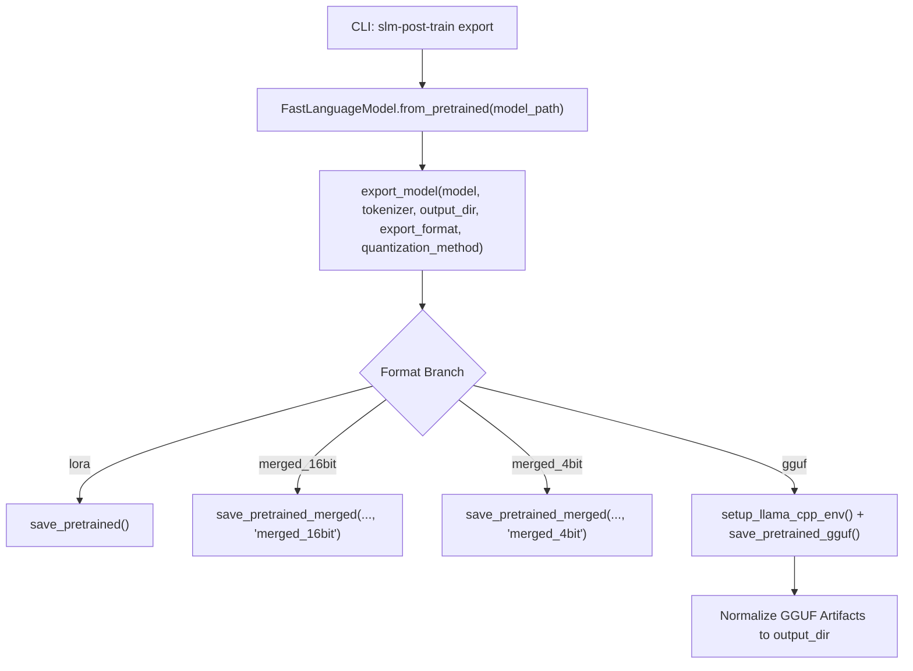

# Model Export & GGUF Quantization Workflows

This guide covers model export, adapter weight merging, and GGUF quantization using Unsloth and the repository's export subsystem (`src/slm_post_train/export/exporter.py`).

---

## Overview

After fine-tuning a Small Language Model (SLM) or Vision-Language Model (VLM) with LoRA or QLoRA, the trained weights reside as low-rank adapter delta files. To deploy these weights in inference engines (vLLM, TGI, Ollama, llama.cpp, or Hugging Face Transformers), you must export them into an appropriate standalone format:

| Format (`--format`) | Description | File Size (0.8B - 3B Model) | Target Runtime |
|---|---|---|---|
| `lora` | Adapter weights only (`adapter_model.safetensors`) | 20 MB – 150 MB | PEFT / Transformers / Unsloth |
| `merged_16bit` | LoRA merged into base model at float16/bfloat16 | 1.5 GB – 6.0 GB | vLLM, TGI, Hugging Face Hub |
| `merged_4bit` | LoRA merged into 4-bit base model | 500 MB – 2.0 GB | Fast 4-bit Hugging Face loading |
| `gguf` | Merged weights quantized to GGUF binary | 400 MB – 2.5 GB | llama.cpp, Ollama, llama-cpp-python |

---

## CLI Reference: `slm-post-train export`

The repository provides a unified CLI entrypoint for exporting models:

```bash
uv run slm-post-train export \
    --model-path <path_or_checkpoint> \
    --output-dir <destination_directory> \
    --format <export_format> \
    [--quant <quantization_method>]
```

### Argument Details

- `--model-path` (required, string):
  - Path to the trained checkpoint directory containing adapter weights (e.g. `outputs/qwen_story/20260927-143000`) or a Hugging Face model repository ID.
- `--output-dir` (required, string):
  - Destination base directory. The exporter automatically appends a timestamp subdirectory `YYYYMMDD-HHMMSS` to ensure exports never overwrite previous artifacts.
- `--format` (optional, string, default: `lora`):
  - Target export format. Allowed choices: `lora`, `merged_16bit`, `merged_4bit`, `gguf`.
- `--quant` (optional, string, default: `q4_k_m`):
  - Quantization method used when `--format gguf` is selected.

---

## Supported GGUF Quantization Methods

When `--format gguf` is specified, `--quant` controls the quantization scheme used by the llama.cpp backend:

| Quantization Type | Bits / Weight | Relative Size | Perplexity Degradation | Recommended Use Case |
|---|---|---|---|---|
| `q4_k_m` | 4.5 bits | ~30% of FP16 | Very low | **Default & Recommended**: optimal speed/size trade-off on <=8GB VRAM and mobile/edge CPUs |
| `q8_0` | 8.0 bits | ~50% of FP16 | Near zero (<0.01 ppl) | High-fidelity serving; excellent for roleplay and creative generation |
| `f16` | 16.0 bits | 100% (baseline) | None | Reference baseline; maximum precision without quantization loss |
| `q5_k_m` | 5.5 bits | ~38% of FP16 | Extremely low | Alternative when VRAM allows slightly higher precision than Q4 |

---

## Internal Exporter Mechanics

The export workflow is implemented in `src/slm_post_train/export/exporter.py` via `export_model()`:



### Key Implementation Details

1. **Timestamped Isolation**:
   ```python
   DT_STR = datetime.now().strftime("%Y%m%d-%H%M%S")
   output_dir = os.path.join(output_dir, DT_STR)
   ```
   Every export run writes into an isolated subfolder, preventing accidental data loss or race conditions across multiple runs.

2. **llama.cpp Environment Setup (`setup_llama_cpp_env`)**:
   - GGUF conversion relies on llama.cpp conversion scripts located in `~/.unsloth/llama.cpp`.
   - `setup_llama_cpp_env()` verifies directory presence and prepends it to both `sys.path` and `os.environ["PYTHONPATH"]`, ensuring conversion submodules are importable.

3. **GGUF Output Directory Normalization**:
   - Unsloth's native `save_pretrained_gguf` creates an adjacent directory named `<output_dir>_gguf`.
   - `exporter.py` automatically detects this artifact folder and copies all `.gguf` binaries and metadata files directly into `<output_dir>`, maintaining clean and predictable file layouts for downstream serving scripts.

---

## Python Programmatic API

You can also run exports programmatically from Python:

```python
from unsloth import FastLanguageModel
from slm_post_train.export.exporter import export_model

# Load model and tokenizer
model_path = "outputs/qwen_story/20260927-143000"
model, tokenizer = FastLanguageModel.from_pretrained(
    model_name=model_path,
    max_seq_length=2048,
    load_in_4bit=True,
)

# Export as GGUF Q4_K_M
export_model(
    model=model,
    tokenizer=tokenizer,
    output_dir="outputs/exports/qwen_story_gguf",
    export_format="gguf",
    quantization_method="q4_k_m",
)
```

---

## Step-by-Step Command Examples

### 1. Export LoRA Adapters Only
Saves the lightweight adapter delta and tokenizer:
```bash
uv run slm-post-train export \
    --model-path outputs/qwen_story/latest \
    --output-dir outputs/exports/lora \
    --format lora
```

### 2. Export 16-Bit Merged Model
Merges adapters into FP16/BF16 base weights:
```bash
uv run slm-post-train export \
    --model-path outputs/qwen_story/latest \
    --output-dir outputs/exports/merged_fp16 \
    --format merged_16bit
```

### 3. Export 4-Bit Merged Model
Produces a compact 4-bit merged Hugging Face checkpoint:
```bash
uv run slm-post-train export \
    --model-path outputs/qwen_story/latest \
    --output-dir outputs/exports/merged_int4 \
    --format merged_4bit
```

### 4. Export Quantized GGUF (`q4_k_m`)
Creates a single quantized `.gguf` binary ready for llama.cpp and Ollama:
```bash
uv run slm-post-train export \
    --model-path outputs/qwen_story/latest \
    --output-dir outputs/exports/gguf_q4 \
    --format gguf \
    --quant q4_k_m
```

### 5. Export High-Precision GGUF (`q8_0`)
Produces an 8-bit quantized GGUF binary:
```bash
uv run slm-post-train export \
    --model-path outputs/qwen_story/latest \
    --output-dir outputs/exports/gguf_q8 \
    --format gguf \
    --quant q8_0
```

---

## VRAM & Memory Budgeting During Export

- **16-bit Merging Memory Spike**:
  Merging 16-bit models dequantizes weights in system RAM or VRAM. For a 3B model, ensure at least 8 GB of available system RAM or VRAM. If merging encounters OOM, run on a system with sufficient host RAM.
- **GGUF Conversion Storage**:
  Unsloth converts first to an unquantized intermediate binary before quantizing to the target bitwidth. Ensure sufficient scratch disk space (at least 2x the model's FP16 size) in `outputs/` or `/tmp`.
