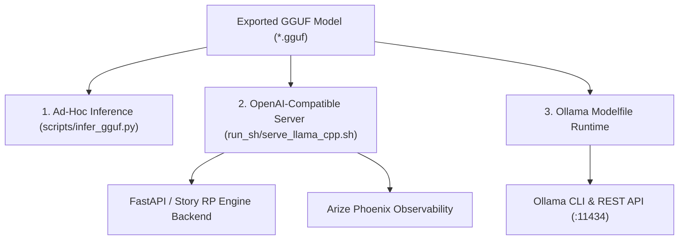

# Serving & Inference with llama.cpp and Ollama

This guide details how to serve and test exported GGUF models locally using `llama_cpp.server`, the integrated serving script `run_sh/serve_llama_cpp.sh`, ad-hoc testing with `scripts/infer_gguf.py`, and containerized or local Ollama deployment.

---

## Overview of Serving Architectures

Quantized GGUF models can be served via multiple execution pathways:



---

## 1. Unified Service Script: `run_sh/serve_llama_cpp.sh`

The repository provides `run_sh/serve_llama_cpp.sh` to spin up an end-to-end local inference and backend environment.

### Script Breakdown

```bash
#!/usr/bin/env bash
set -e
cd "$(dirname "$0")/.."
[ -f .env ] && set -a && . ./.env && set +a

trap 'kill $(jobs -p) 2>/dev/null' EXIT

# 1. Start llama.cpp model server
HOST="$LLAMA_HOST" PORT="$LLAMA_PORT" uv run python -m llama_cpp.server \
    --model "$LLAMA_MODEL_PATH" \
    --model_alias "${STORY_RP_MODEL#*/}" \
    --host "$LLAMA_HOST" \
    --port "$LLAMA_PORT" \
    --n_gpu_layers "$N_GPU_LAYERS" \
    --n_ctx "$N_CTX" &

# Wait for server readiness
until curl -s "http://$LLAMA_HOST:$LLAMA_PORT/v1/models" >/dev/null 2>&1; do
    sleep 1
done

# 2. Start Arize Phoenix Observability (if enabled)
[ "$PHOENIX_ENABLED" = "true" ] && uv run phoenix serve &

# 3. Start Backend API
uv run python -m uvicorn story_rp_engine.api.app:create_app \
    --factory \
    --host "$HOST" \
    --port "$PORT" \
    --reload
```

### Key Environment Variables (`.env`)

Configure the following variables in `.env` before running:

```ini
# llama.cpp server parameters
LLAMA_MODEL_PATH=outputs/exports/qwen_story_gguf/20260927-143000/Qwen3.5-0.8B.Q4_K_M.gguf
LLAMA_HOST=127.0.0.1
LLAMA_PORT=8001
N_GPU_LAYERS=-1       # -1 offloads all layers to GPU; 0 runs CPU only
N_CTX=2048            # Context window size in tokens

# Story RP backend parameters
STORY_RP_MODEL=local/Qwen3.5-0.8B
HOST=127.0.0.1
PORT=8000
PHOENIX_ENABLED=false # Set to true to start Phoenix LLM tracing dashboard
```

### Execution & Graceful Shutdown

- Run:
  ```bash
  bash run_sh/serve_llama_cpp.sh
  ```
- The trap handler `trap 'kill $(jobs -p) 2>/dev/null' EXIT` ensures that stopping the script (via `Ctrl+C` or `SIGINT`) automatically terminates the background `llama_cpp.server`, `phoenix`, and `uvicorn` processes cleanly without leaving orphaned child processes on ports `8000` or `8001`.

---

## 2. Direct `llama_cpp.server` Parameters

When running the OpenAI-compatible HTTP server directly via `uv run python -m llama_cpp.server`:

| Parameter | Type | Default | Description |
|---|---|---|---|
| `--model` | path | Required | Path to the `.gguf` file |
| `--model_alias` | string | `None` | Alias exposed in `/v1/models` and used by client requests |
| `--host` | string | `127.0.0.1` | Network interface to bind |
| `--port` | int | `8000` | Port to listen on |
| `--n_gpu_layers` | int | `0` | Number of model layers to offload to GPU (`-1` = all) |
| `--n_ctx` | int | `2048` | Context window size |
| `--n_threads` | int | CPU cores / 2 | Number of CPU threads for inference |
| `--chat_format` | string | Auto | Chat handler template (e.g. `chatml`, `llama-3`, `gemma`) |

### Standard Endpoints

The server exposes standard OpenAI-compatible endpoints:
- `GET http://localhost:8001/v1/models` - Lists loaded model aliases.
- `POST http://localhost:8001/v1/chat/completions` - Streaming and non-streaming chat completions.
- `POST http://localhost:8001/v1/completions` - Raw completion endpoint.
- `GET http://localhost:8001/docs` - Interactive OpenAPI/Swagger documentation.

---

## 3. Ad-Hoc Inference Testing: `scripts/infer_gguf.py`

For quick local testing without spinning up an HTTP server, use the standalone inference script `scripts/infer_gguf.py`.

### Script Structure & Constants

```python
MODEL_PATH = "outputs/exports/qwen_story_gguf/20260927-143000/Qwen3.5-0.8B.Q4_K_M.gguf"
SYSTEM_PROMPT = "You are a creative writer."
PROMPT = "Write a short opening scene for a mystery story."

TEMPERATURE = 0.7
TOP_P = 0.9
REPEAT_PENALTY = 1.1
MAX_TOKENS = None       # None generates until EOS token
N_GPU_LAYERS = -1       # -1 for full GPU offload, 0 for CPU
N_CTX = 2048
STREAM = True           # Stream token chunks to terminal in real time
VERBOSE = False
```

### Running the Test Script

```bash
uv run python scripts/infer_gguf.py
```

### Programmatic Python Usage

```python
from llama_cpp import Llama

llm = Llama(
    model_path="outputs/exports/qwen_story_gguf/20260927-143000/Qwen3.5-0.8B.Q4_K_M.gguf",
    n_gpu_layers=-1,
    n_ctx=2048,
    verbose=False,
)

response = llm.create_chat_completion(
    messages=[
        {"role": "system", "content": "You are a creative writer."},
        {"role": "user", "content": "Describe a deserted space station."},
    ],
    temperature=0.7,
    top_p=0.9,
    repeat_penalty=1.1,
    max_tokens=256,
)
print(response["choices"][0]["message"]["content"])
```

---

## 4. Serving with Ollama

You can import any exported GGUF model into Ollama using a custom `Modelfile`.

### Creating a Modelfile

Create a file named `Modelfile` in your export directory:

```dockerfile
FROM ./outputs/exports/qwen_story_gguf/20260927-143000/Qwen3.5-0.8B.Q4_K_M.gguf

PARAMETER temperature 0.7
PARAMETER top_p 0.9
PARAMETER repeat_penalty 1.1
PARAMETER num_ctx 2048
PARAMETER stop "<|im_end|>"
PARAMETER stop "<|endoftext|>"

TEMPLATE """{{ if .System }}<|im_start|>system
{{ .System }}<|im_end|>
{{ end }}{{ if .Prompt }}<|im_start|>user
{{ .Prompt }}<|im_end|>
{{ end }}<|im_start|>assistant
{{ .Response }}<|im_end|>"""

SYSTEM """You are an engaging story writer and character roleplayer."""
```

### Importing & Running in Ollama

```bash
# 1. Build the model in Ollama
ollama create story-slm -f Modelfile

# 2. Verify model is registered
ollama list

# 3. Test interactive chat via CLI
ollama run story-slm "Introduce yourself."

# 4. Query via Ollama REST API
curl http://localhost:11434/api/chat -d '{
  "model": "story-slm",
  "messages": [
    {"role": "user", "content": "Hello world!"}
  ],
  "stream": false
}'
```

---

## 5. Performance Tuning & Troubleshooting

### GPU Offloading (`n_gpu_layers`)
- **Full Offloading (`-1`)**: Offloads all layers to VRAM. Maximizes tokens-per-second generation speed.
- **Partial Offloading (`1` to `N-1`)**: Offloads a fraction of transformer layers when VRAM is tight (e.g., 4GB or 6GB GPU). The remaining layers run on CPU system RAM without crashing.
- **CPU-Only (`0`)**: Runs purely on CPU with AVX/NEON SIMD instructions. Useful for testing or environments lacking CUDA/Metal.

### Context Length Sizing (`n_ctx`)
- llama.cpp pre-allocates KV cache based on `n_ctx`.
- Setting `n_ctx: 2048` uses ~150-300 MB of KV memory for an 0.8B-3B model.
- Setting `n_ctx: 8192` uses ~1-1.5 GB of KV memory. Keep `n_ctx` matched to your training sequence length (`max_seq_length`).

### Port Conflicts
If port `8000` or `8001` is already in use:
```bash
# Check running process
lsof -i :8001
# Kill stale llama.cpp server if necessary
kill -9 $(lsof -t -i :8001)
```
