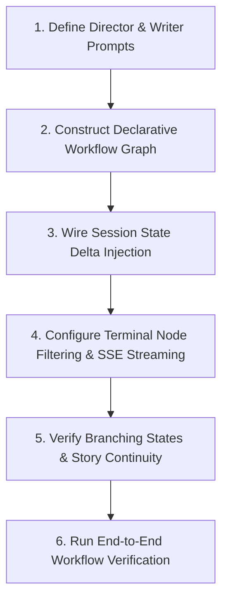

# Story Co-Pilot Skill

Operational guide and guardrails for building, tuning, and extending the collaborative multi-agent storytelling pipeline in `story_rp_engine.story`, powered by Google ADK 2.0 declarative workflow graphs.

---

## Workflow: Method Ladder

Follow these sequential steps when designing, configuring, or debugging the Story Co-Pilot multi-agent workflow:



### 1. Define Director & Writer Prompts
- Author the Story Director instruction in `story_rp_engine.story.director_agent`:
  - Enforce concise scene framing, emotional atmosphere, and pacing guidance.
  - Constrain output to exactly 2–3 brief sentences.
  - Inject optional state parameters: `{premise?}`, `{genre?}`, `{tone?}`, `{current_text?}`.
- Author the Story Writer instruction in `story_rp_engine.story.writer_agent`:
  - Direct the agent to write polished literary prose adhering to the Director's framing, user instruction, genre, and tone.
  - Enforce zero preamble and seamless continuation from `{current_text?}`.
- Consult `references/director-writer-pipeline.md` for prompt templates, pacing rules, and anti-preamble constraints.

### 2. Construct Declarative Workflow Graph
- Define the multi-agent graph in `story_rp_engine.story.workflow.create_story_workflow`:
  - Instantiate `director` and `writer` using `EngineConfig`.
  - Assemble the workflow DAG using declarative edges: `edges=[("START", director, writer)]`.
  - Ensure graph nodes resolve to `__START__`, `story_director`, and `story_writer`.
- Consult `references/story-workflow-graph.md` for DAG topologies, node execution sequence, and graph validation.

### 3. Wire Session State Delta Injection
- Populate session state via `state_delta` dictionary during runner execution:
  - `premise`: Global story premise or background world lore.
  - `genre`: Primary genre taxonomy (e.g. `"Fantasy"`, `"Sci-Fi"`).
  - `tone`: Narrative tenor (e.g. `"Epic"`, `"Grimdark"`, `"Whimsical"`).
  - `current_text`: Prose accumulated across preceding turns.
  - `instruction`: Immediate user directive guiding the upcoming scene beat.
- Pass `state_delta` to `runner.run_async(user_id=..., session_id=..., new_message=..., state_delta=state_delta)`.

### 4. Configure Terminal Node Filtering & SSE Streaming
- Use `story_rp_engine.core.agent_utils._get_terminal_node_name` to dynamically identify the terminal node (`story_writer`).
- Filter intermediate events in `execute_runner_turn` and `stream_runner_turn` (`event.author != target_node`) so intermediate directorial memos do not contaminate user-facing prose.
- For interactive streaming, wrap the asynchronous generator in `format_sse_stream` with configurable token chunking.

### 5. Verify Branching States & Story Continuity
- Support branching storylines by cloning session state under a new `session_id` (`f"{parent_session_id}_branch_{timestamp}"`).
- Support scene re-rolls by executing new turns with identical `current_text` and modified `instruction` or `tone`.
- Verify that previous scene prose remains immutable on divergent paths.

### 6. Run End-to-End Workflow Verification
- Validate agent parameters, graph structure, instruction rendering, and streaming endpoints through automated tests in `tests/story_rp_engine/test_story_workflow.py`.

---

## Critical Guardrails

1. **Strict 2–3 Sentence Director Guidance**:
   - The Director agent must never write prose, dialogue, or full scene drafts. Its output must remain strictly 2–3 sentences of scene framing, atmosphere, and pacing guidance.
2. **Terminal Node Output Suppression**:
   - Upstream directorial memos must be suppressed in end-user narrative feeds (`event.author == target_node`). Never leak Director planning text into the final prose output unless operating in dedicated HITL co-pilot mode.
3. **Anti-Preamble & Zero Meta-Commentary**:
   - The Writer agent must immediately generate narrative prose. Conversational filler (e.g. *"Here is the continuation:"*, *"Sure, I can write that!"*) is strictly prohibited.
4. **Seamless Continuation (No Repetition)**:
   - The Writer must resume directly from the end of `current_text` without repeating the final sentence or re-introducing characters already present in the active scene.
5. **Google ADK Optional State Syntax (`{var?}`)**:
   - All state variables in agent instructions must use the `{variable?}` optional syntax. Unmarked `{variable}` placeholders will crash the ADK prompt builder when fields are omitted from `state_delta`.
6. **SLM Context Window Stewardship**:
   - For 8B Small Language Models (SLMs) operating with 2K–8K context limits, prune or summarize `current_text` once history exceeds 1,500 tokens to prevent KV-cache exhaustion.
7. **Declarative Workflow Integrity**:
   - Workflows must use declarative ADK graph edges `("START", director, writer)`. Do not use deprecated procedural wrapper functions (`format_story_input`, `format_story_director_input`).

---

## Verification Commands

Validate the Story Co-Pilot skill and workflow engine:

```bash
# 1. Run agent skills validation for story-copilot
uv run pytest tests/test_agent_skills.py -k "story-copilot" -v

# 2. Run all story workflow graph and agent tests
uv run pytest tests/story_rp_engine/test_story_workflow.py -v

# 3. Run entire story RP engine test suite
uv run pytest tests/story_rp_engine/ -v
```

---

## Reference Guides

Detailed technical specifications are available in the 1-level deep references:
- `references/director-writer-pipeline.md`: Story Director prompt engineering, pacing/tone steering outputs, Story Writer prose constraints, anti-preamble rules, and SLM context budget management.
- `references/story-workflow-graph.md`: Google ADK 2.0 declarative graph architecture, topological execution order, terminal node filtering, SSE streaming, branching scene trees, and human review loop patterns.
