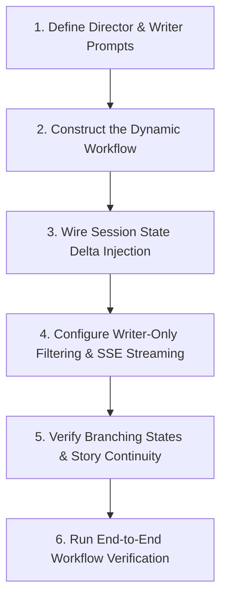

# Story Co-Pilot Skill

Operational guide and guardrails for building, tuning, and extending the collaborative multi-agent storytelling pipeline in `story_rp_engine.story`, powered by a Google ADK 2.0 dynamic workflow.

---

## Workflow: Method Ladder

Follow these sequential steps when designing, configuring, or debugging the Story Co-Pilot multi-agent workflow:



### 1. Define Director & Writer Prompts
- Author the Story Director instruction in `story_rp_engine.story.director_agent`:
  - The director reads the whole (compacted) conversation and writes short free-form notes for the writer: what the next passage must do, its beats and where it stops, plus any earlier story facts the writer needs (the writer sees only the recent text).
  - Inject optional state parameters: `{premise?}`, `{genre?}`, `{tone?}`, `{current_text?}`.
  - Keep `include_contents="default"`; without it the workflow gives the director no history.
  - `director_before_model_callback` appends the session lorebook's matching entries (keys found in the user's message) to the user's latest message. The director passes the lore the passage needs on in its notes; the writer never sees the lorebook.
- Author the Story Writer instruction in `story_rp_engine.story.writer_agent`:
  - Direct the agent to write polished literary prose adhering to the Director's framing, user instruction, genre, and tone.
  - Enforce zero preamble and seamless continuation from `{current_text?}`.
- Consult `references/director-writer-pipeline.md` for prompt templates, pacing rules, and anti-preamble constraints.

### 2. Construct the Dynamic Workflow
- `story_rp_engine.story.workflow.create_story_workflow` builds `Workflow(edges=[("START", story_turn)])`, where `story_turn` is an `@node(rerun_on_resume=True)` function:
  - `notes = await ctx.run_node(director)`: no input, so the director reads the user's message from the history instead of seeing it twice.
  - `return await ctx.run_node(writer, notes)`: the writer's only message is the director's notes.
- Consult `references/story-workflow-graph.md` for DAG topologies, node execution sequence, and graph validation.

### 3. Wire Session State Delta Injection
- Populate session state via `state_delta` dictionary during runner execution:
  - `premise`: Global story premise or background world lore.
  - `genre`: Primary genre taxonomy (e.g. `"Fantasy"`, `"Sci-Fi"`).
  - `tone`: Narrative tenor (e.g. `"Epic"`, `"Grimdark"`, `"Whimsical"`).
  - `current_text`: The last `RECENT_TEXT_CHARS` (8000) characters of the story, which `routes_story` builds from the session's earlier `story_writer` replies.
- The story UI is a chat. `premise`, `genre` and `tone` come with the first turn and stay in state; `routes_story` only writes the ones a request sets, so follow-ups send just `instruction`.
  - `instruction`: Immediate user directive guiding the upcoming scene beat.
- Pass `state_delta` to `runner.run_async(user_id=..., session_id=..., new_message=..., state_delta=state_delta)`.

### 4. Configure Terminal Node Filtering & SSE Streaming
- Pass `author="story_writer"` to `execute_runner_turn` and `stream_runner_turn` so only the writer's events reach the user; the director's notes are skipped.
- For interactive streaming, wrap the asynchronous generator in `format_sse_stream` with configurable token chunking.

### 5. Verify Branching States & Story Continuity
- Support branching storylines by cloning session state under a new `session_id` (`f"{parent_session_id}_branch_{timestamp}"`).
- Support scene re-rolls by executing new turns with a modified `instruction` or `tone`.
- Verify that previous scene prose remains immutable on divergent paths.

### 6. Run End-to-End Workflow Verification
- Validate agent parameters, graph structure, instruction rendering, and streaming endpoints through automated tests in `tests/story_rp_engine/test_story_workflow.py`.

---

## Critical Guardrails

1. **Director Writes Notes, Not Prose**:
   - The Director agent must never write prose, dialogue, or full scene drafts. Its output is short notes: the passage's goal, beats and stopping point, plus earlier story facts the writer needs.
2. **Writer-Only Output**:
   - Director notes must not reach end users: story routes pass `author="story_writer"` to the runner helpers. Never leak Director planning text into the final prose output unless operating in dedicated HITL co-pilot mode.
3. **Anti-Preamble & Zero Meta-Commentary**:
   - The Writer agent must immediately generate narrative prose. Conversational filler (e.g. *"Here is the continuation:"*, *"Sure, I can write that!"*) is strictly prohibited.
4. **Seamless Continuation (No Repetition)**:
   - The Writer must resume directly from the end of `current_text` without repeating the final sentence or re-introducing characters already present in the active scene.
5. **Google ADK Optional State Syntax (`{var?}`)**:
   - All state variables in agent instructions must use the `{variable?}` optional syntax. Unmarked `{variable}` placeholders will crash the ADK prompt builder when fields are omitted from `state_delta`.
6. **Context Window Stewardship**:
   - Agents see only the last `RECENT_TEXT_CHARS` of `current_text`; earlier parts reach the director through session history and compaction summaries. `story_app` uses turn-count compaction only (no `token_threshold`), because token-threshold compaction can run between the director and the writer and summarize away the notes.
7. **Workflow Shape**:
   - Keep the director reading history and the writer reading only the notes. Don't feed the user message to the director as node input (it would see it twice), and don't use `mode="chat"` agents in a static graph (nodes after them never run).

---

## Verification Commands

Validate the Story Co-Pilot skill and workflow engine:

```bash
# 1. Run agent skills validation for story-copilot
uv run pytest tests/test_agent_skills.py -k "story-copilot" -v

# 2. Run all story workflow graph and agent tests
uv run pytest tests/story_rp_engine/test_story_workflow.py -v

# 3. Run entire story RP engine test suite
uv run pytest tests/story_rp_engine/ -v
```

---

## Reference Guides

Detailed technical specifications are available in the 1-level deep references:
- `references/director-writer-pipeline.md`: Story Director prompt engineering, pacing/tone steering outputs, Story Writer prose constraints, anti-preamble rules, and SLM context budget management.
- `references/story-workflow-graph.md`: Google ADK 2.0 dynamic workflow architecture, what each agent sees, writer-only filtering, SSE streaming, story compaction, branching scene trees, and human review loop patterns.
