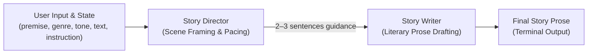

# Director-Writer Pipeline Reference

Comprehensive technical guide to the two-stage collaborative narrative generation pipeline in `story_rp_engine.story`, covering Story Director prompt engineering, scene pacing and tonal steering, and Story Writer prose generation constraints.

---

## Table of Contents
1. [Architectural Overview](#architectural-overview)
2. [Story Director Agent](#story-director-agent)
   - [Role & Separation of Concerns](#role--separation-of-concerns)
   - [System Instruction & State Interpolation](#system-instruction--state-interpolation)
   - [Pacing and Tone Guidance Output Format](#pacing-and-tone-guidance-output-format)
   - [Exemplar Director Outputs](#exemplar-director-outputs)
3. [Story Writer Agent](#story-writer-agent)
   - [Role & Craftsmanship](#role--craftsmanship)
   - [System Instruction & Constraint Architecture](#system-instruction--constraint-architecture)
   - [Anti-Preamble & Continuity Enforcement](#anti-preamble--continuity-enforcement)
   - [Exemplar Writer Outputs](#exemplar-writer-outputs)
4. [State Dictionary & Context Propagation](#state-dictionary--context-propagation)
5. [SLM Context Budgeting (2K–8K Tokens)](#slm-context-budgeting-2k8k-tokens)
6. [Python Implementation & Test Patterns](#python-implementation--test-patterns)

---

## Architectural Overview

Single-prompt story generation models often struggle with dual cognitive burdens: balancing macro-level narrative pacing, thematic tension, and plot progression while simultaneously crafting evocative, sensory-rich prose.

The **Story Co-Pilot** pipeline decomposes creative writing into a two-agent Google ADK 2.0 collaborative sequence:



1. **Story Director (`story_director`)**: Analyzes the current story state, premise, tone, and user prompt. Emits a concise 2–3 sentence directorial memo dictating scene framing, emotional resonance, and pacing acceleration/deceleration.
2. **Story Writer (`story_writer`)**: Ingests the Director's memo alongside the story parameters, picking up seamlessly from existing prose (`current_text`) to generate polished literary narrative without conversational filler.

---

## Story Director Agent

### Role & Separation of Concerns
The Director operates strictly at the architectural level. It does **not** write dialogue, monologue, or descriptive prose. Instead, it determines:
- **Focus**: Which character, environmental shift, or conflict anchors the next beat.
- **Emotional Atmosphere**: The visceral mood (e.g. suffocating dread, tentative warmth, brittle tension).
- **Scene Progression**: How the beat advances the story arc (e.g. escalating a confrontation, delivering a revelation, lingering in an emotional aftermath).

### System Instruction & State Interpolation
The Director's prompt utilizes Google ADK optional state placeholders (`{variable?}`) that are populated at runtime via session state:

```python
from google.adk.agents import LlmAgent
from story_rp_engine.core.config import EngineConfig
from story_rp_engine.core.model_provider import get_adk_model

def create_director_agent(config: EngineConfig) -> LlmAgent:
    instruction = (
        "You are an expert Story Director. Your job is to provide concise scene framing, tonal direction, "
        "and narrative pacing guidance. Given a story premise, existing prose, prior dialogue/generation history, "
        "and user instruction (which may expand, continue, or modify previous scenes), "
        "output 2-3 brief sentences guiding the Writer on focus, emotional atmosphere, and scene progression.\n\n"
        "### Story Parameters\n"
        "- Premise: {premise?}\n"
        "- Genre: {genre?}\n"
        "- Tone: {tone?}\n\n"
        "### Existing Text\n"
        "{current_text?}"
    )
    return LlmAgent(
        name="story_director",
        model=get_adk_model(config),
        instruction=instruction,
    )
```

### Pacing and Tone Guidance Output Format
The Director's response must conform to strict structural conventions:
- **Length**: Exactly 2 to 3 concise sentences.
- **Content Blocks**:
  1. *Immediate Focus & Perspective*: Identify the focal element (e.g., character sensory perception or environmental omen).
  2. *Atmospheric & Tonal Steering*: Calibrate emotional temperature aligned with `{tone?}` and `{genre?}`.
  3. *Beat Trajectory*: Dictate where the scene should transition before yielding back to the user.

### Exemplar Director Outputs

#### Example 1: Dark Fantasy / High Suspense
- **Premise**: An ancient subterranean vault sealed by blood wards.
- **Current Text**: *"The iron door groaned under the weight of centuries as the final rune flickered and died."*
- **User Instruction**: *"Vaelen steps across the threshold into the dark."*
- **Director Memo**:
  > *"Direct the writer to highlight Vaelen's hesitation at the threshold, focusing on the sensory shock of stagnant, freezing air and the smell of ancient incense. Keep the pacing tense and measured, magnifying the acoustic echoes of his bootsteps against silent stone. Conclude the beat just as a faint luminescence stirs deeper within the chamber."*

#### Example 2: Sci-Fi Noir / Introspective
- **Premise**: An orbital detective investigating illegal synthetic memories.
- **Tone**: Gritty, melancholic.
- **Director Memo**:
  > *"Frame the scene tightly around Silas inspecting the cracked memory chip beneath the neon glare of his cramped workshop. Emphasize the rhythmic hum of failing air scrubbers and his growing cynical fatigue. Guide the scene toward an unexpected data glitch that reveals a timestamp he recognizes."*

---

## Story Writer Agent

### Role & Craftsmanship
The Writer agent is the literary prose engine. It executes the scene conceived by the Director, prioritizing:
- **Sensory Grounding**: Concrete physical details (texture, sound, temperature, lighting).
- **Subtext & Internal Voice**: Character psychology reflected through action rather than exposition.
- **Stylistic Flow**: Cadence, varied sentence length, and rhythmic prose matching the established genre.

### System Instruction & Constraint Architecture
The Writer's instruction connects state parameters with the Director's preceding turn:

```python
from google.adk.agents import LlmAgent
from story_rp_engine.core.config import EngineConfig
from story_rp_engine.core.model_provider import get_adk_model

def create_writer_agent(config: EngineConfig) -> LlmAgent:
    instruction = (
        "You are an accomplished Fiction Writer. Your task is to write immersive, polished literary prose. "
        "Honor the Director's scene framing, user's instruction, genre ({genre?}), and tone ({tone?}). "
        "Seamlessly continue or modify the story based on prior context and generations without unnecessary preamble or meta-commentary.\n\n"
        "### Story Premise\n"
        "{premise?}\n\n"
        "### Existing Text to Continue\n"
        "{current_text?}"
    )
    return LlmAgent(
        name="story_writer",
        model=get_adk_model(config),
        instruction=instruction,
    )
```

### Anti-Preamble & Continuity Enforcement
Small language models (SLMs) frequently inject conversational artifacts when roleplaying as a writer. The Writer agent prompt enforces strict negative constraints:

1. **Zero Meta-Commentary**:
   - **Banned**: *"Sure! Here is the continuation of your story:"*, *"In this next section, we see..."*, *"I hope you enjoy this chapter!"*.
   - **Enforcement**: Model begins immediately with the first narrative token.
2. **Direct Continuation (Seamless Seam)**:
   - Does not repeat the last sentence of `{current_text?}` unless explicitly asked to rewrite.
   - Matches the POV (first-person `"I"` vs third-person `"he/she/they"`) and tense (past vs present) already established.
3. **No Breaking Character / Fourth-Wall Guard**:
   - Never addresses the user or comments on the Director's instructions.

### Exemplar Writer Outputs
Following the Dark Fantasy Director Memo above:

> *"The cold inside the vault was not merely the absence of heat; it had teeth. It sank through the boiled leather of Vaelen’s cuirass, settling into his marrow with the dry bitterness of embalming herbs. Beneath his boot, the calcified dust of centuries crunched with a sound like shattering porcelain, ringing out into the subterranean cavern before being swallowed whole by the oppressive silence. He paused, fingers white-knuckled against the hilt of his shortsword. Then, ten paces ahead where shadow reigned absolute, a sickly pale-green luminescence pulsed once, bathing the ribs of ancient stonework in corpse-light."*

---

## State Dictionary & Context Propagation

The ADK Runner passes state down the graph via `state_delta`. Both agents share access to this persistent session state:

| State Variable | Data Type | Source | Description |
| :--- | :--- | :--- | :--- |
| `premise` | `str` | `StoryRequest.premise` | Overarching narrative foundation and high-level premise. |
| `genre` | `str` | `StoryRequest.genre` | Primary genre label (e.g. `"Fantasy"`, `"Sci-Fi"`, `"Thriller"`). |
| `tone` | `str` | `StoryRequest.tone` | Guiding mood and emotional tenor (e.g. `"Epic"`, `"Noir"`, `"Balanced"`). |
| `current_text` | `str` | `StoryRequest.current_text` | Preceding prose accumulated across prior generation turns. |
| `instruction` | `str` | `StoryRequest.instruction` | Immediate user directive guiding the current turn. |

When a turn executes:
```python
state_delta = {
    "premise": req.premise or "Not specified",
    "genre": req.genre or "Fiction",
    "tone": req.tone or "Balanced",
    "current_text": req.current_text or "",
    "instruction": req.instruction or "Expand the story based on the context.",
}
```

ADK automatically interpolates `{variable?}` syntax into the agents' `instruction` during prompt preparation. If a variable is missing or empty, `{variable?}` evaluates to an empty string without raising key errors.

---

## SLM Context Budgeting (2K–8K Tokens)

When operating with 8B-parameter Small Language Models (e.g. Llama 3.1 8B, Gemma 2 9B), preserving context budget is critical:

1. **Director Guidance Brevity**:
   - Keeping Director memos capped at 2–3 sentences (approx. 50–90 tokens) minimizes intermediate history overhead.
2. **Current Text Pruning / Rolling Window**:
   - When cumulative `current_text` exceeds 1,500 tokens, pass only the premise, a short summary of preceding events, and the last 500–800 tokens of immediate prose to prevent context starvation.
3. **Loss-Free Prompt Packing**:
   - System instructions for Director and Writer are kept concise (<150 tokens each), leaving >90% of the active context window for narrative prose and generation rollouts.

---

## Python Implementation & Test Patterns

### Testing Agent Definitions
Unit tests in `tests/story_rp_engine/test_story_workflow.py` verify that agent instructions maintain required parameter tokens:

```python
def test_create_director_and_writer_agents():
    config = EngineConfig(model_name="ollama/llama3.1:8b")
    director = create_director_agent(config)
    writer = create_writer_agent(config)

    assert director.name == "story_director"
    assert "{premise?}" in director.instruction
    assert "{genre?}" in director.instruction
    assert "{tone?}" in director.instruction
    assert "{current_text?}" in director.instruction

    assert writer.name == "story_writer"
    assert "{premise?}" in writer.instruction
    assert "{genre?}" in writer.instruction
    assert "{tone?}" in writer.instruction
    assert "{current_text?}" in writer.instruction
```

### Mocking Pipeline Execution
To verify instruction rendering without incurring LLM inference costs:

```python
class MockCaptureLlm(BaseLlm):
    model: str = "mock"
    agent_name: str = ""

    async def generate_content_async(self, llm_request, stream=False):
        # Captured prompt includes rendered system instructions
        system_inst = llm_request.config.system_instruction
        yield LlmResponse(
            partial=False,
            content=types.Content(parts=[types.Part.from_text(text=f"{self.agent_name} output")]),
        )
```
