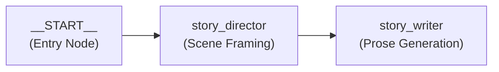
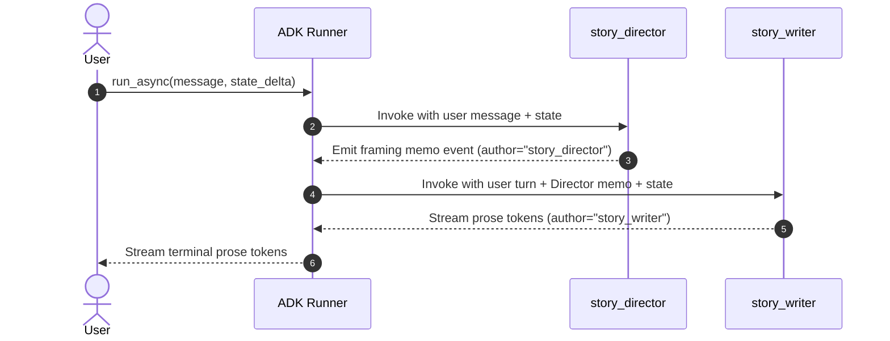
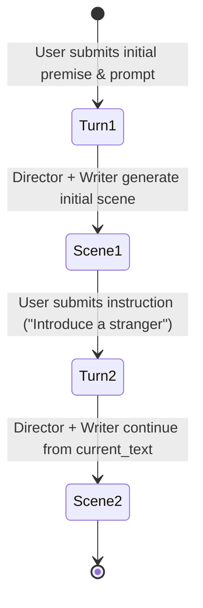
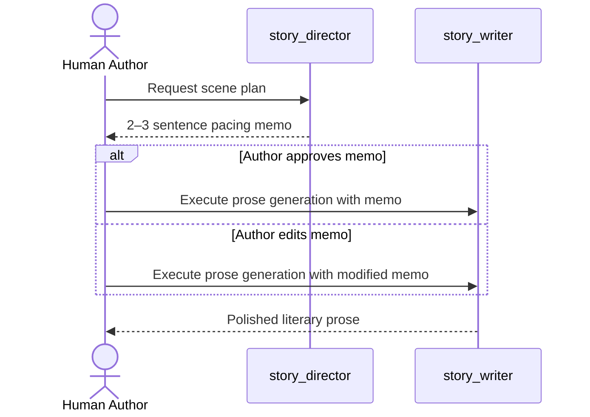

# Story Workflow Graph Reference

Comprehensive architectural guide to the Google ADK 2.0 multi-agent workflow graph in `story_rp_engine.story`, covering declarative DAG topologies, node execution order, terminal node filtering, streaming mechanics, state transitions, branching story trees, and human review loops.

---

## Table of Contents
1. [Google ADK 2.0 Workflow Architecture](#google-adk-20-workflow-architecture)
2. [Declarative Graph Topology](#declarative-graph-topology)
3. [Node Execution Order & Event Flow](#node-execution-order--event-flow)
4. [Terminal Node Filtering & Streaming Engine](#terminal-node-filtering--streaming-engine)
5. [State Dictionary Transitions & Session Lifecycle](#state-dictionary-transitions--session-lifecycle)
6. [Branching Scene Logic & Story Trees](#branching-scene-logic--story-trees)
7. [Human-in-the-Loop (HITL) Review Loop](#human-in-the-loop-hitl-review-loop)
8. [API Endpoints & Integration Patterns](#api-endpoints--integration-patterns)

---

## Google ADK 2.0 Workflow Architecture

In Google ADK 2.0, multi-agent coordination is structured declaratively through the `Workflow` class. Rather than hardcoding procedural orchestration in Python functions, workflows define an executable Directed Acyclic Graph (DAG) of agents.

The core narrative pipeline in `story_rp_engine.story.workflow` implements this pattern:

```python
from google.adk import Workflow
from story_rp_engine.core.config import EngineConfig
from story_rp_engine.story.director_agent import create_director_agent
from story_rp_engine.story.writer_agent import create_writer_agent

def create_story_workflow(config: EngineConfig) -> Workflow:
    """Creates a declarative ADK Graph Workflow connecting Director and Writer agents."""
    director = create_director_agent(config)
    writer = create_writer_agent(config)

    return Workflow(
        name="story_workflow",
        edges=[
            ("START", director, writer)
        ],
    )
```

---

## Declarative Graph Topology

The declarative edge specification `("START", director, writer)` constructs a linear pipeline connecting the workflow entry point to the two agents in series:



### Graph Components
- **`__START__`**: Internal ADK root node that receives the incoming user message and session state.
- **`story_director` (`LlmAgent`)**: Intermediate node that analyzes premise, context, and instruction to formulate scene pacing guidance.
- **`story_writer` (`LlmAgent`)**: Terminal node that synthesizes the Director's guidance and context into published literary prose.

### Edge Semantics
When an edge `(source, target)` is traversed:
1. `source` executes its turn.
2. The output generated by `source` is appended to the session message history.
3. `target` is invoked with access to the accumulated conversation history and updated state.

---

## Node Execution Order & Event Flow

When a turn is dispatched through `google.adk.runners.Runner.run_async()`, ADK executes nodes in topological order:



1. **Step 1 (Root Ingestion)**: The runner receives `new_message` (user instruction) and `state_delta` (premise, genre, tone, current text).
2. **Step 2 (Director Turn)**: `story_director` executes. Its LLM call evaluates the instruction alongside state variables and emits an intermediate `LlmResponse` containing 2–3 sentences of scene pacing guidance.
3. **Step 3 (Writer Turn)**: `story_writer` receives the full conversation turn (including the Director's memo) and its own system instructions. It produces the final prose.

---

## Terminal Node Filtering & Streaming Engine

In a collaborative pipeline, the user should receive the Writer's polished prose—**not** the Director's internal framing notes—unless explicitly running in debugging or interactive co-pilot mode.

### Terminal Node Detection
`story_rp_engine.core.agent_utils._get_terminal_node_name` dynamically identifies the terminal node by inspecting the graph's edge set:

```python
def _get_terminal_node_name(agent: Any) -> Optional[str]:
    """Finds the terminal node name in a Workflow graph if present."""
    if hasattr(agent, "graph") and hasattr(agent.graph, "edges") and hasattr(agent.graph, "nodes"):
        from_nodes = {e.from_node.name for e in agent.graph.edges}
        for n in agent.graph.nodes:
            if n.name != "__START__" and n.name not in from_nodes:
                return n.name
    return None
```

In the story workflow, `story_writer` has no outgoing edges, correctly identifying it as the terminal node.

### Filtering Non-Terminal Events
Both `execute_runner_turn` (batch) and `stream_runner_turn` (streaming) discard intermediate events from upstream nodes:

```python
async for event in runner.run_async(...):
    # Suppress output from intermediate agents (story_director)
    if target_node and event.author and event.author != target_node:
        continue
    ...
```

### Token Streaming & Server-Sent Events (SSE)
For real-time user experiences, `stream_runner_turn` runs with `RunConfig(streaming_mode=StreamingMode.SSE)`. Tokens are buffered into configurable chunks via `format_sse_stream`:

```python
generator = stream_runner_turn(
    runner,
    user_id="User",
    session_id=req.session_id,
    message=user_instruction,
    state_delta=state_delta,
)
return StreamingResponse(
    format_sse_stream(generator, chunk_size=req.chunk_size),
    media_type="text/event-stream",
    headers={"X-Session-ID": req.session_id},
)
```

---

## State Dictionary Transitions & Session Lifecycle

The ADK Runner maintains persistent conversation sessions via `SessionService` (`InMemorySessionService` or database-backed stores).

### Multi-Turn State Accumulation



At each turn:
1. The client appends newly generated prose to `current_text`.
2. The user supplies a new `instruction`.
3. The API posts a new `StoryRequest`:

```json
{
  "session_id": "session_story_001",
  "premise": "An alchemist seeks the celestial ember.",
  "genre": "Fantasy",
  "tone": "Mysterious",
  "current_text": "The crucible glowed with an unsettling sapphire hue...",
  "instruction": "The workshop door is kicked open by city guards."
}
```

4. The `state_delta` updates the ADK session state:
   - `{current_text?}` in system instructions reflects the latest story prose.
   - `{instruction}` guides the Director's next pacing decision.

---

## Branching Scene Logic & Story Trees

Interactive fiction and co-pilot writing require **non-linear branching** (alternate takes, choice branches, or what-if explorations).

### Branching Data Model

```
                    [Root Scene 1]
                    "The Vault Opens"
                           |
            +--------------+--------------+
            |                             |
      [Branch A]                    [Branch B]
  "Vaelen steps in"             "Vaelen retreats"
  (Session: sess_001_A)         (Session: sess_001_B)
            |                             |
     [Scene 2A]                    [Scene 2B]
  "Luminescence stirs"          "Ambushed outside"
```

### Implementing Branching in ADK
Because sessions in ADK are keyed by `session_id`:
1. **Forking a Branch**:
   - Generate a new branch session ID: `new_session_id = f"{parent_session_id}_branch_{timestamp}"`.
   - Seed the new session with the parent's `premise`, `genre`, `tone`, and `current_text` up to the branch point.
2. **Re-Rolling a Scene**:
   - Keep `session_id` and `current_text` identical.
   - Invoke the runner with a modified `tone` or an alternate `instruction` (e.g. *"Make the entrance more sudden and combat-oriented"*).
   - Replace the uncommitted candidate text with the new output.

---

## Human-in-the-Loop (HITL) Review Loop

The Story Co-Pilot supports two operational modes:

### 1. Fully Autonomous Mode
- The workflow runs end-to-end: `START -> Director -> Writer -> Output`.
- The user only reviews the final prose.

### 2. Interactive Co-Pilot Mode (Steerable Director)
In interactive co-pilot mode, the Director's memo is surfaced for author approval or revision before prose generation begins:



This human review checkpoint prevents hallucinated plot trajectories early, before computational budget is spent generating full prose chapters.

---

## API Endpoints & Integration Patterns

The workflow is exposed via FastAPI routes in `src/story_rp_engine/api/routes_story.py`:

### Synchronous Expansion
- **Endpoint**: `POST /api/v1/story/expand`
- **Request Body**: `StoryRequest` (Pydantic model)
- **Response**: `{"expansion": "...", "session_id": "..."}`

### Real-Time SSE Streaming
- **Endpoint**: `POST /api/v1/story/expand/stream`
- **Request Body**: `StoryRequest`
- **Response**: `StreamingResponse(content, media_type="text/event-stream")`
- **Headers**: `X-Session-ID: <session_id>`
- **Chunk Format**: SSE events formatted as `data: {"text": "..."}\n\n`

---

## Context Compaction in Multi-Agent Workflows

In multi-scene story expansions, conversation and state history can quickly exhaust the LLM's context window. The Story Co-Pilot workflow leverages ADK 2.x context compaction configured on `App(name="story_app", root_agent=workflow, events_compaction_config=...)`.

### Explicit Summarizer Requirement
Because `root_agent` is a `Workflow` (which does not have a single canonical LLM), ADK cannot auto-resolve an agent model. The engine explicitly provides an `LlmEventSummarizer`:

```python
from google.adk.apps.app import EventsCompactionConfig
from google.adk.apps.llm_event_summarizer import LlmEventSummarizer
from story_rp_engine.core.model_provider import get_adk_model

model = get_adk_model(config)
summarizer = LlmEventSummarizer(llm=model, prompt_template=config.compaction_prompt_template)

compaction_cfg = EventsCompactionConfig(
    token_threshold=config.compaction_token_threshold,
    event_retention_size=config.compaction_event_retention_size,
    compaction_interval=config.compaction_interval,
    overlap_size=config.compaction_overlap_size,
    summarizer=summarizer,
)
```

This ensures both token-threshold safety triggers and sliding-window periodic turn summaries operate seamlessly during extended multi-scene story generation.

