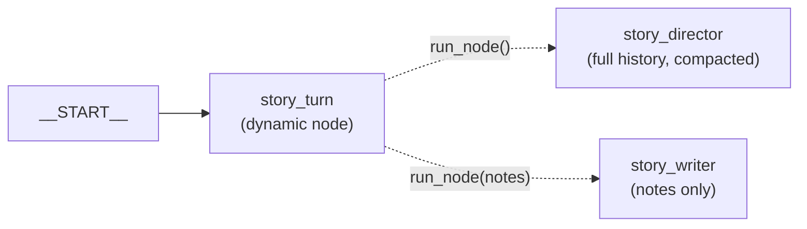
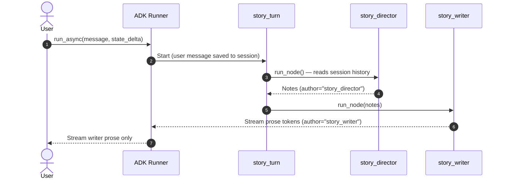
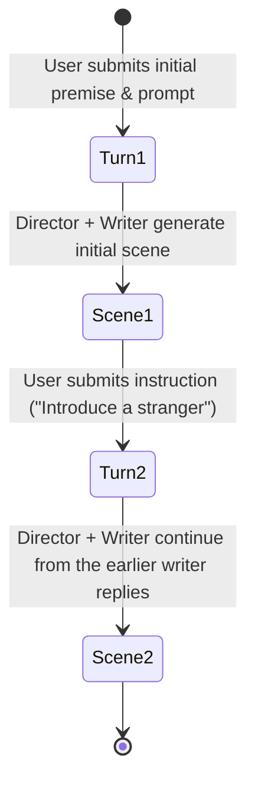
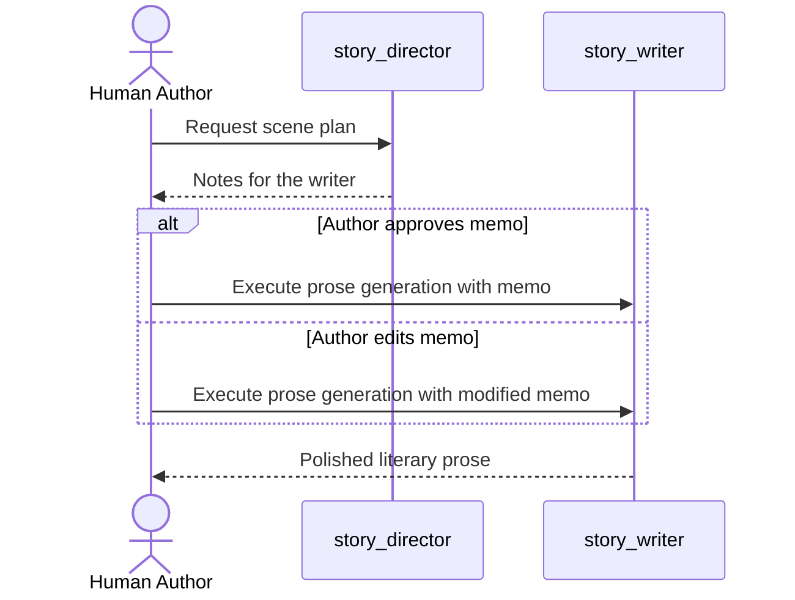

# Story Workflow Graph Reference

Comprehensive architectural guide to the Google ADK 2.0 multi-agent workflow in `story_rp_engine.story`, covering the dynamic workflow topology, what each agent sees, writer-only event filtering, streaming mechanics, state transitions, compaction, branching story trees, and human review loops.

---

## Table of Contents
1. [Google ADK 2.0 Workflow Architecture](#google-adk-20-workflow-architecture)
2. [Dynamic Workflow Topology](#dynamic-workflow-topology)
3. [Node Execution Order & Event Flow](#node-execution-order--event-flow)
4. [Writer-Only Filtering & Streaming Engine](#writer-only-filtering--streaming-engine)
5. [State Dictionary Transitions & Session Lifecycle](#state-dictionary-transitions--session-lifecycle)
6. [Branching Scene Logic & Story Trees](#branching-scene-logic--story-trees)
7. [Human-in-the-Loop (HITL) Review Loop](#human-in-the-loop-hitl-review-loop)
8. [API Endpoints & Integration Patterns](#api-endpoints--integration-patterns)

---

## Google ADK 2.0 Workflow Architecture

`story_rp_engine.story.workflow` builds a **dynamic** ADK `Workflow`: the graph has a single step, `story_turn`, and the orchestration lives in plain Python inside it via `ctx.run_node`:

```python
from google.adk import Context, Workflow
from google.adk.workflow import node

def create_story_workflow(config: EngineConfig) -> Workflow:
    director = create_director_agent(config)
    writer = create_writer_agent(config)

    @node(rerun_on_resume=True)
    async def story_turn(ctx: Context):
        # No input: the director reads the user's message from the conversation history.
        notes = await ctx.run_node(director)
        return await ctx.run_node(writer, notes)

    return Workflow(name="story_workflow", edges=[("START", story_turn)])
```

`rerun_on_resume=True` is required: ADK refuses `ctx.run_node` from a node without it.

---

## Dynamic Workflow Topology



### What each agent sees
An `LlmAgent` run inside a workflow defaults to `mode="single_turn"` and, unless `include_contents` is passed explicitly, `include_contents="none"`: its request holds only its node input.

- **`story_director`** passes `include_contents="default"`, so it reads the whole session history: past user instructions, its own earlier notes, the writer's passages (shown as `For context: [story_writer] said: ...`) and compaction summaries in place of older turns. It is called **with no input**; passing the user message as input would add it a second time.
- **`story_writer`** keeps the default: its only message is the director's notes. The story parameters, the user instruction and the recent text reach it through its `{key?}` system-prompt template.

### Why not other shapes
- A static graph `("START", director, writer)` with a history-reading director shows the director the user message twice (once from the session, once as node input).
- A `mode="chat"` agent in a static graph must follow `START` directly, and nodes after it never run.

---

## Node Execution Order & Event Flow



---

## Writer-Only Filtering & Streaming Engine

The user should receive the Writer's prose, not the Director's notes. `routes_story` passes `author="story_writer"` to `execute_runner_turn` and `stream_runner_turn`, which skip every other event:

```python
async for event in runner.run_async(...):
    if author and event.author != author:
        continue
    ...
```

The filter is explicit because the graph's last node is `story_turn`, while the text events are authored by the agents it runs.

### Token Streaming & Server-Sent Events (SSE)
`stream_runner_turn` runs with `RunConfig(streaming_mode=StreamingMode.SSE)`; `format_sse_stream` buffers tokens into chunks:

```python
generator = stream_runner_turn(
    runner,
    user_id="User",
    session_id=req.session_id,
    message=user_instruction,
    state_delta=state_delta,
    author="story_writer",
)
return StreamingResponse(
    format_sse_stream(generator, chunk_size=req.chunk_size),
    media_type="text/event-stream",
    headers={"X-Session-ID": req.session_id},
)
```

---

## State Dictionary Transitions & Session Lifecycle

The ADK Runner maintains persistent conversation sessions via `SessionService` (`InMemorySessionService` or database-backed stores).

### Multi-Turn State Accumulation



At each turn:
1. The first turn carries the story setup with the opening instruction:

```json
{
  "session_id": "session_story_001",
  "premise": "An alchemist seeks the celestial ember.",
  "genre": "Fantasy",
  "tone": "Mysterious",
  "instruction": "Open in her workshop at midnight."
}
```

2. Follow-up chat turns send only the message; `premise`, `genre` and `tone` stay in session state:

```json
{
  "session_id": "session_story_001",
  "instruction": "The workshop door is kicked open by city guards."
}
```

4. The `state_delta` updates the ADK session state:
   - `{current_text?}` in system instructions holds the last `RECENT_TEXT_CHARS` (8000) characters of the story, built from the session's earlier `story_writer` replies; the director covers earlier parts through the session history.
   - `{instruction}` guides the Director's next pacing decision.

---

## Branching Scene Logic & Story Trees

Interactive fiction and co-pilot writing require **non-linear branching** (alternate takes, choice branches, or what-if explorations).

### Branching Data Model

```
                    [Root Scene 1]
                    "The Vault Opens"
                           |
            +--------------+--------------+
            |                             |
      [Branch A]                    [Branch B]
  "Vaelen steps in"             "Vaelen retreats"
  (Session: sess_001_A)         (Session: sess_001_B)
            |                             |
     [Scene 2A]                    [Scene 2B]
  "Luminescence stirs"          "Ambushed outside"
```

### Implementing Branching in ADK
Because sessions in ADK are keyed by `session_id`:
1. **Forking a Branch**:
   - Generate a new branch session ID: `new_session_id = f"{parent_session_id}_branch_{timestamp}"`.
   - Seed the new session with the parent's `premise`, `genre`, `tone`, and its events up to the branch point (the story text comes from the `story_writer` events).
2. **Re-Rolling a Scene**:
   - Keep `session_id` identical.
   - Invoke the runner with a modified `tone` or an alternate `instruction` (e.g. *"Make the entrance more sudden and combat-oriented"*).
   - Replace the uncommitted candidate text with the new output.

---

## Human-in-the-Loop (HITL) Review Loop

The Story Co-Pilot supports two operational modes:

### 1. Fully Autonomous Mode
- The workflow runs end-to-end: `START -> Director -> Writer -> Output`.
- The user only reviews the final prose.

### 2. Interactive Co-Pilot Mode (Steerable Director)
In interactive co-pilot mode, the Director's memo is surfaced for author approval or revision before prose generation begins:



This human review checkpoint prevents hallucinated plot trajectories early, before computational budget is spent generating full prose chapters.

---

## API Endpoints & Integration Patterns

The workflow is exposed via FastAPI routes in `src/story_rp_engine/api/routes_story.py`:

### Synchronous Expansion
- **Endpoint**: `POST /api/v1/story/expand`
- **Request Body**: `StoryRequest` (Pydantic model)
- **Response**: `{"expansion": "...", "session_id": "..."}`

### Real-Time SSE Streaming
- **Endpoint**: `POST /api/v1/story/expand/stream`
- **Request Body**: `StoryRequest`
- **Response**: `StreamingResponse(content, media_type="text/event-stream")`
- **Headers**: `X-Session-ID: <session_id>`
- **Chunk Format**: SSE events formatted as `data: {"text": "..."}\n\n`

---

## Context Compaction in Multi-Agent Workflows

Long stories are handled by ADK context compaction on `App(name="story_app", root_agent=workflow, events_compaction_config=...)`. Compaction only shortens the history an agent reads, so it affects the director (which reads history) and not the writer (which does not).

`AgentRegistry.get_story_runner` builds a story-specific config:

```python
compaction_config = EventsCompactionConfig(
    compaction_interval=config.compaction_interval,
    overlap_size=config.compaction_overlap_size,
    summarizer=LlmEventSummarizer(
        llm=get_adk_model(config),
        prompt_template=config.compaction_prompt_template or STORY_SUMMARY_PROMPT,
    ),
)
```

- **Turn-count compaction only (no `token_threshold`).** Token-threshold compaction also runs before each model call, so it can fire between the director and the writer and summarize away the director's notes before the writer reads them.
- **Explicit summarizer.** The root is a `Workflow`, not an `LlmAgent`, so ADK cannot pick a summarizer model on its own.
- **`STORY_SUMMARY_PROMPT`** (in `story/workflow.py`) asks for characters, places, events in order, open threads, POV/tense/style and lasting user preferences; ADK's default prompt is written for tool-using assistants.
- Sliding-window summaries do not carry earlier summaries forward, so the director sees every summary, oldest first.
