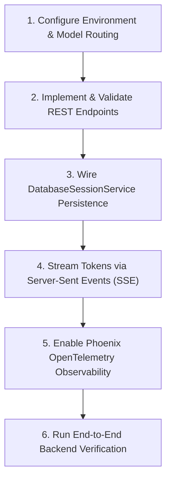

# Story & RP Backend Skill

Operational guide and guardrails for developing, maintaining, and debugging the FastAPI REST API, Server-Sent Events (SSE) streaming, persistent SQLite session storage, LiteLLM routing, and OpenTelemetry observability in `story_rp_engine.api`.

---

## Workflow: Method Ladder

Follow these sequential steps when modifying, testing, or troubleshooting the backend engine:



### 1. Configure Environment & Model Routing
- Verify environment variables in `run_sh/run_story_rp_backend.sh` and `story_rp_engine.core.config.EngineConfig`:
  - `STORY_RP_MODEL`: Model identifier (e.g., `ollama/llama3.1:8b`, `vllm/meta-llama/Meta-Llama-3.1-8B-Instruct`).
  - `STORY_RP_API_BASE`: Endpoint URL for local LLM or OpenAI-compatible server (e.g., `http://localhost:11434`).
  - `STORY_RP_API_KEY`: API key if required (auto-defaults to `"local"` if OpenAI-compatible base URL is supplied).
  - `STORY_RP_COMPACTION_ENABLED`: Enable ADK context compaction (`1`/`true`/`yes`, default enabled).
  - `STORY_RP_COMPACTION_TOKEN_THRESHOLD` & `STORY_RP_COMPACTION_EVENT_RETENTION_SIZE`: Token-based safety net compaction parameters.
  - `STORY_RP_COMPACTION_INTERVAL` & `STORY_RP_COMPACTION_OVERLAP_SIZE`: Sliding-window turn-based compaction parameters.
- Initialize the model provider via `story_rp_engine.core.model_provider.get_adk_model`.
- Consult `references/database-session-storage.md` for LiteLLM failover chaining, multi-model router setup, and context compaction mechanics.

### 2. Implement & Validate REST Endpoints
- Implement routes across modular routers mounted on `/api/v1`:
  - `story_rp_engine.api.routes_rp`: Character card CRUD (`/api/v1/characters`), RP turn execution (`/api/v1/rp/chat`), turn history (`/api/v1/rp/sessions/{session_id}/turns`), and session deletion.
  - `story_rp_engine.api.routes_story`: Multi-agent collaborative narrative expansion (`/api/v1/story/expand`).
  - `story_rp_engine.api.routes_lorebook`: World info codex CRUD (`/api/v1/lorebooks`).
- Enforce strict ID validation with `_sanitize_key` to prevent path traversal attacks.
- Intercept Pydantic validation errors with `validation_exception_handler` to return structured HTTP 400 responses.
- Consult `references/api-endpoints-and-sse.md` for complete endpoint schemas and status codes.

### 3. Wire DatabaseSessionService Persistence & Context Compaction
- Persist multi-turn conversation events and state deltas using Google ADK's `DatabaseSessionService` backed by `aiosqlite`.
- Structure storage directory at `.engine_data/` containing `characters/`, `lorebooks/`, and `sessions.db`.
- Configure hybrid context compaction using `EventsCompactionConfig` with explicit `LlmEventSummarizer(llm=model)` on `App` (enabling both token-based safety net and sliding-window periodic compression).
- Extract message turns via `get_session` and surface compaction events with `role: "compaction"` and `is_compaction: true`. Handle turn deletion or history rewind via the atomic session re-creation pattern.
- Consult `references/database-session-storage.md` for SQLite tables (`sessions`, `events`, `app_states`, `user_states`), context compaction lifecycle, and async CRUD patterns.

### 4. Stream Tokens via Server-Sent Events (SSE)
- Expose streaming endpoints (`/api/v1/rp/chat/stream` and `/api/v1/story/expand/stream`) using Starlette `StreamingResponse(media_type="text/event-stream")`.
- Execute agent workflows with `RunConfig(streaming_mode=StreamingMode.SSE)`.
- Wrap token generators with `format_sse_stream` to yield structured JSON deltas (`data: {"delta": "..."}\n\n`), consolidated completion payloads (`data: {"full_text": "...", "done": true}\n\n`), and the termination sentinel (`data: [DONE]\n\n`).
- Respect `chunk_size` buffering and trigger immediate flushes on newline (`\n`) characters.
- Consult `references/api-endpoints-and-sse.md` for SSE wire formats and client consumption patterns.

### 5. Enable Phoenix OpenTelemetry Observability
- Configure Arize Phoenix tracing by setting `PHOENIX_ENABLED=1`, `PHOENIX_COLLECTOR_ENDPOINT`, and `PHOENIX_PROJECT_NAME`.
- The application automatically registers OpenTelemetry hooks in `create_app()` during startup.
- Trace end-to-end request latencies, LLM token counts, prompt templates, and ADK multi-agent workflow DAG node transitions.

### 6. Run End-to-End Backend Verification
- Execute automated tests to verify routing, validation error handling, path traversal protection, SSE streaming chunks, and session persistence:
  ```bash
  uv run pytest tests/story_rp_engine/test_api.py -v
  ```

---

## Critical Guardrails

1. **Path Traversal Sanitization**:
   - All dynamic path parameters and body IDs (`char_id`, `session_id`, `lorebook_id`) must be sanitized using `_sanitize_key`. Any ID containing `/`, `\`, or `..` must immediately raise HTTP 400.
2. **Strict SSE Protocol & Sentinel Formatting**:
   - Streaming endpoints must strictly follow SSE framing: `data: {"delta": "..."}\n\n`, final payload `data: {"full_text": "...", "done": true}\n\n`, and end with `data: [DONE]\n\n`. Never terminate a stream without the `[DONE]` sentinel.
3. **Structured Validation Error Normalization**:
   - Validation errors must be caught by `validation_exception_handler` and returned as HTTP 400 with a structured body (`{"error": ..., "detail": ..., "missing_fields": [...]}`). Avoid raw 422 Unprocessable Entity responses for user input validation.
4. **Atomic Session Rewind & Turn Truncation**:
   - Because ADK event storage is append-only, deleting or truncating turns must atomically delete the existing session and re-create it with surviving events to maintain database consistency and update markers.
5. **Local LLM Key Auto-Injection**:
   - When pointing LiteLLM to local OpenAI-compatible endpoints without an API key, auto-inject `api_key="local"` to prevent client library initialization errors.
6. **Safe Lifespan Startup Warmup**:
   - Model warmup during FastAPI lifespan must be non-blocking and error-tolerant. If the model server is cold or offline, log a warning and continue app startup rather than crashing the server. Honor `STORY_RP_SKIP_WARMUP=1`.
7. **Terminal Node Output Filtering**:
   - In multi-agent story workflows, intermediate directorial memos from `story_director` must never be emitted over user-facing SSE streams. Only stream tokens from the terminal `story_writer` node.
8. **Explicit Summarizer for Graph Workflows**:
   - In ADK 2.x, when attaching `EventsCompactionConfig` to `App`, graph workflows (`root_agent=Workflow`) do not possess a single default canonical model and will raise `ValueError: No LlmAgent model available` if `summarizer` is omitted. Always instantiate an explicit `LlmEventSummarizer(llm=get_adk_model(config))` for both single agents and workflows.

---

## Verification Commands

Validate the `story-rp-backend` skill and backend server:

```bash
# 1. Run agent skills validation for story-rp-backend
uv run pytest tests/test_agent_skills.py -k "story-rp-backend" -v

# 2. Run all backend API endpoint and streaming tests
uv run pytest tests/story_rp_engine/test_api.py -v

# 3. Launch backend development server
bash run_sh/run_story_rp_backend.sh
```

---

## Reference Guides

Detailed technical specifications are available in the 1-level deep references:
- `references/api-endpoints-and-sse.md`: REST route specifications, request/response models, SSE chunk framing, buffering controls, error handling, and client integration examples.
- `references/database-session-storage.md`: `DatabaseSessionService` SQLite schema, async CRUD operations via `aiosqlite`, history pruning and rewinds, LiteLLM failover routing, and Arize Phoenix tracing.
