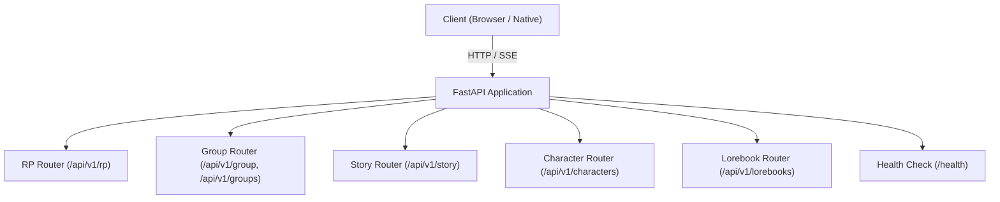
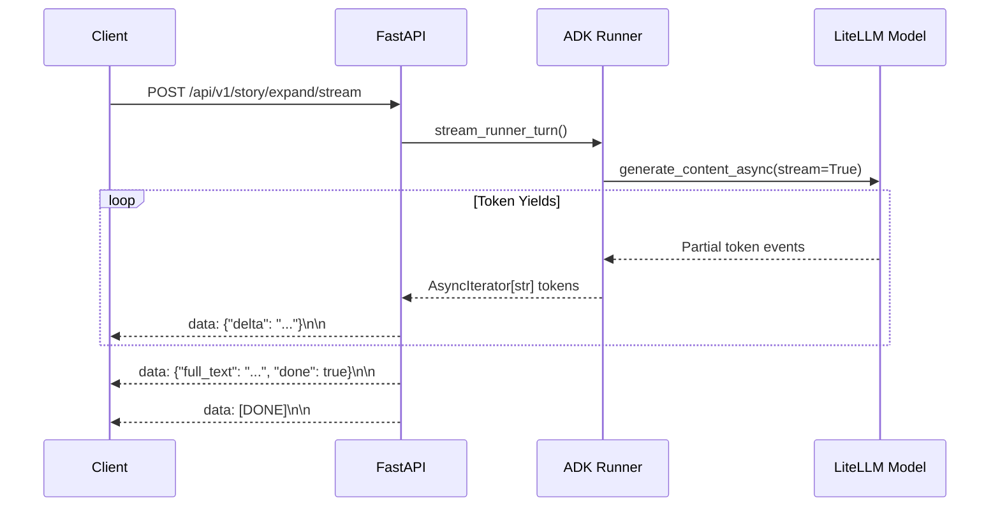

# FastAPI REST Endpoints and Server-Sent Events (SSE) Specification

This guide provides technical specifications for the REST routes, request/response models, Server-Sent Events (SSE) streaming protocols, and error handling mechanics in `story_rp_engine.api`.

---

## 1. REST Endpoint Specifications

All primary application API routes are mounted under the `/api/v1` prefix.



### 1.1 Roleplay Endpoints (`/api/v1/rp` & `/api/v1/characters`)

#### `POST /api/v1/characters`
Creates or updates a character card persona stored as JSON.

- **Request Body**: `CharacterCard` (JSON)
  - `char_id` (str, required): Unique identifier (e.g., `"lyra"`). Sanitized against directory traversal.
  - `name` (str, required): Display name of character.
  - `description` (str, optional): Backstory and physical appearance.
  - `personality` (str, optional): Behavioral traits and mannerisms.
  - `scenario` (str, optional): Current roleplay setting or circumstance.
  - `first_mes` (str, optional): Initial greeting message from character.
  - `mes_example` (str, optional): Dialogue examples in `<START>` format.
  - `system_prompt` (str, optional): Optional override for core instruction.
  - `post_history_instructions` (str, optional): Directives appended after chat history.
  - `alternate_greetings` (list[str], optional): Additional opening greetings.
  - `creator_notes` (str, optional): Metadata notes.
  - `tags` (list[str], optional): Category tags.
  - `lorebook_id` (str, optional): Lorebook the web UI selects when a new chat with this character starts.
- **Response**: `200 OK`
  ```json
  {
    "status": "saved",
    "char_id": "lyra"
  }
  ```
- **Error Responses**:
  - `400 Bad Request`: If `char_id` contains path traversal characters (`..`, `/`, `\`) or is empty.

#### `GET /api/v1/characters`
Lists all available character cards in storage.

- **Response**: `200 OK` — Mapping of `char_id` to `CharacterCard` objects:
  ```json
  {
    "lyra": {
      "char_id": "lyra",
      "name": "Lyra",
      "description": "Elven bard",
      "personality": "Cheerful, inquisitive",
      "scenario": "A lively wayside tavern",
      "first_mes": "Greetings, traveler! What song shall we sing tonight?",
      "mes_example": "",
      "tags": ["fantasy", "bard"]
    }
  }
  ```

#### `GET /api/v1/characters/{char_id}`
Retrieves a specific character card.

- **Path Parameter**: `char_id` (str) — Character identifier.
- **Response**: `200 OK` — `CharacterCard` JSON.
- **Error Responses**:
  - `400 Bad Request`: Path traversal or invalid key.
  - `404 Not Found`: Character file does not exist.

#### `DELETE /api/v1/characters/{char_id}`
Deletes a character card from disk and evicts cached agents and runners from `AgentRegistry`.

- **Response**: `200 OK`
  ```json
  {
    "status": "deleted",
    "char_id": "lyra"
  }
  ```

#### `POST /api/v1/rp/chat`
Executes a synchronous roleplay chat turn via Google ADK Runner.

- **Request Body**: `RPChatRequest` (JSON)
  - `char_id` (str, required): Target character card identifier.
  - `session_id` (str, required): Conversation session tracking ID.
  - `message` (str, required): User message text.
  - `authors_note` (str, optional): Steering guidance injected into prompt context.
  - `user_name` (str, optional): User persona name (defaults to `"User"`).
  - `chunk_size` (int, optional): Buffer size (default: 16).
- **Response**: `200 OK`
  ```json
  {
    "reply": "I tune my lute and smile warmly at you.",
    "session_id": "session_123"
  }
  ```
- **Error Responses**:
  - `400 Bad Request`: Invalid session ID or traversal key.
  - `404 Not Found`: Character ID not found in store.

#### `POST /api/v1/rp/chat/stream`
Streams assistant response tokens asynchronously using Server-Sent Events (SSE).

- **Request Body**: `RPChatRequest` (identical to `/api/v1/rp/chat`).
- **Response**: `200 OK` with `Content-Type: text/event-stream`.
- **Event Flow**:
  ```
  data: {"delta": "I tune"}

  data: {"delta": " my lute"}

  data: {"delta": " and smile."}

  data: {"full_text": "I tune my lute and smile.", "done": true}

  data: [DONE]
  ```

#### `GET /api/v1/rp/sessions/{session_id}/turns`
Retrieves chat turns from `DatabaseSessionService`.

- **Response**: `200 OK`
  ```json
  {
    "turns": [
      {"index": 0, "role": "user", "text": "Hello Lyra"},
      {"index": 1, "role": "model", "text": "Greetings, traveler!"}
    ]
  }
  ```

#### `DELETE /api/v1/rp/sessions/{session_id}`
Completely deletes a session and clears its persisted database events.

- **Response**: `200 OK`: `{"status": "deleted", "session_id": "session_123"}`

#### `POST /api/v1/rp/sessions/{session_id}/turns/delete`
Prunes or rewinds session history.

- **Request Body**: `DeleteTurnRequest`
  - `turn_index` (int, required): Target turn index in session history.
  - `truncate_subsequent` (bool, optional, default: false):
    - `false`: Deletes only the event at `turn_index`.
    - `true`: Rewinds session to `turn_index`, discarding all later turns.
- **Response**: `200 OK`: `{"status": "ok", "remaining_turns": 4}`

---

### 1.2 Story Co-Pilot Endpoints (`/api/v1/story`)

#### `POST /api/v1/story/expand`
Executes synchronous collaborative prose expansion using the Director-Writer multi-agent graph.

- **Request Body**: `StoryRequest` (JSON)
  - `session_id` (str, required): Multi-turn story session ID.
  - `instruction` (str, optional): The user's chat message for this turn (default: `"Continue the story naturally from the current point."`).
  - `premise` (str, optional): Narrative background context. Sent with the first turn; kept in session state.
  - `genre` (str, optional): Literary genre (e.g., `"Cyberpunk"`, `"Fantasy"`). First turn; kept in state.
  - `tone` (str, optional): Narrative mood (e.g., `"Grimdark"`, `"Witty"`). First turn; kept in state.
  - The story text isn't sent: the backend builds it from the session's earlier `story_writer` replies.
  - `max_tokens` (int, optional): Generation cap (1–131072, default: 512).
  - `chunk_size` (int, optional): Streaming token batching (default: 16).
- **Response**: `200 OK`
  ```json
  {
    "expansion": "Rain slicked the neon pavement as the hovercar descended.",
    "session_id": "story_sess_01"
  }
  ```

#### `POST /api/v1/story/expand/stream`
Streams literary prose expansion via Server-Sent Events (SSE).

- **Request Body**: `StoryRequest` (JSON).
- **Response**: `200 OK` with `Content-Type: text/event-stream` and header `X-Session-ID: <session_id>`.

---

### 1.3 Lorebook Endpoints (`/api/v1/lorebooks`)

- `POST /api/v1/lorebooks`: Saves a lorebook definition. Automatically generates a URL-safe slug from `name`.
- `GET /api/v1/lorebooks`: Returns all saved lorebooks as a dictionary keyed by `lorebook_id`.
- `GET /api/v1/lorebooks/{lorebook_id}`: Retrieves single lorebook JSON.
- `DELETE /api/v1/lorebooks/{lorebook_id}`: Deletes lorebook file.

---

### 1.4 Group Chat Endpoints (`/api/v1/groups` & `/api/v1/group`)

A group puts several characters in one scene; a speaker selector picks who replies each turn.

- `POST /api/v1/groups`: Saves a `GroupCard` (`group_id`, `name`, `char_ids`, `scenario`, `first_mes`, `lorebook_id`). Returns `{"status": "saved", "group_id": ...}`; `400` for an invalid `group_id`.
- `GET /api/v1/groups`: Returns all groups keyed by `group_id`.
- `GET /api/v1/groups/{group_id}`: Retrieves one group (`404` if missing).
- `DELETE /api/v1/groups/{group_id}`: Deletes the group and evicts its cached runner (`404` if missing).
- `POST /api/v1/group/chat/stream`: Streams one group turn over SSE (see section 2.1). Body `GroupChatRequest`: `group_id`, `session_id`, `message` (required); `authors_note`, `user_name`, `lorebook_id`, `greeting`, `chunk_size` (optional, as in `RPChatRequest`). `404` if the group or lorebook is missing; `400` if the group has no characters or the session ID is invalid.
- `GET /api/v1/group/sessions?group_id=`: Chats with one group, newest first.
- `GET /api/v1/group/sessions/{session_id}/turns`: Same shape as the RP turns plus `speaker` (the `char_id`, `null` for the user); the selector's events are hidden.
- `PATCH /api/v1/group/sessions/{session_id}`: Renames the chat (`{"title": ...}`).
- `DELETE /api/v1/group/sessions/{session_id}`: Deletes the session.
- `POST /api/v1/group/sessions/{session_id}/turns/delete`: Same body as the RP route; indexes ignore the selector's events.

---

### 1.5 System Endpoints

- `GET /health`: Returns `{"status": "ok"}` for container liveness/readiness probes.
- `GET /`: Serves static web UI assets from `src/story_rp_engine/web` if the directory exists.

---

## 2. Server-Sent Events (SSE) Protocol Specification

The streaming endpoints leverage asynchronous token generation via Starlette `StreamingResponse` and Google ADK's `RunConfig(streaming_mode=StreamingMode.SSE)`.

### 2.1 Event Framing & Chunk Formatting

Tokens from the LLM are streamed asynchronously and buffered through `format_sse_stream`.



#### Protocol Wire Format

1. **Incremental Deltas**:
   Emitted as tokens accumulate up to `chunk_size` or immediately upon encountering a newline (`\n`):
   ```http
   data: {"delta": "The shadowed gateway "}

   data: {"delta": "loomed in the distance.\n"}
   ```

2. **Completed Text Payload**:
   Emitted once the model completes generation, providing the consolidated string:
   ```http
   data: {"full_text": "The shadowed gateway loomed in the distance.\n", "done": true}
   ```

3. **Termination Sentinel**:
   Emitted as the final event to signal connection termination to clients:
   ```http
   data: [DONE]
   ```

4. **Group Chat Variant** (`/api/v1/group/chat/stream`):
   Each delta carries the speaking character's `char_id`, and the final payload lists every reply instead of `full_text`:
   ```http
   data: {"speaker": "bob", "delta": "Bob "}

   data: {"speaker": "alice", "delta": "Alice line"}

   data: {"replies": [{"speaker": "bob", "text": "Bob line"}, {"speaker": "alice", "text": "Alice line"}], "done": true}

   data: [DONE]
   ```

#### Alternative `sse-starlette` Chunk Formatting
For clients parsing custom SSE event fields (`event: message` and `event: done`):
```http
event: message
data: {"chunk": "The shadowed gateway "}

event: message
data: {"chunk": "loomed in the distance."}

event: done
data: {"full_text": "The shadowed gateway loomed in the distance.", "done": true}
```

### 2.2 Buffering & Chunk Size Control
- **Parameter**: `chunk_size` (integer, 1–100, default: 4 or 16).
- **Buffer Flush Rules**:
  1. The buffer flushes when `len(buffer) >= chunk_threshold`.
  2. The buffer flushes immediately if any incoming chunk contains `\n`.
  3. Trailing tokens are flushed prior to the final payload.

### 2.3 HTTP Headers for SSE Responses
SSE responses must specify:
- `Content-Type: text/event-stream`
- `Cache-Control: no-cache`
- `Connection: keep-alive`
- `X-Accel-Buffering: no` (disables buffering in Nginx reverse proxies)
- Optional tracking header: `X-Session-ID: <session_id>`

---

## 3. Request Validation & Error Handling

### 3.1 Custom Validation Exception Handler
In `src/story_rp_engine/api/app.py`, Pydantic's `RequestValidationError` is intercepted to format clear error summaries:

```json
{
  "error": "Missing required fields: session_id | Invalid fields: max_tokens: Input should be greater than or equal to 1",
  "detail": "Missing required fields: session_id | Invalid fields: max_tokens: Input should be greater than or equal to 1",
  "missing_fields": ["session_id"]
}
```

### 3.2 Path Traversal Sanitization
All ID parameters (`char_id`, `group_id`, `session_id`, `lorebook_id`) are validated using `_sanitize_key`:
- Rejects any string containing `/`, `\`, or `..`.
- Rejects empty or whitespace-only keys.
- Raises `HTTPException(status_code=400, detail="Invalid ID: path traversal characters not allowed")`.

---

## 4. Client Integration Examples

### 4.1 JavaScript / Browser SSE Consumption

```typescript
async function streamStory(sessionId: string, instruction: string) {
  const response = await fetch('/api/v1/story/expand/stream', {
    method: 'POST',
    headers: { 'Content-Type': 'application/json' },
    body: JSON.stringify({
      session_id: sessionId,
      instruction: instruction,
      chunk_size: 4
    })
  });

  const reader = response.body?.getReader();
  const decoder = new TextDecoder();
  let accumulated = '';

  if (!reader) return;

  while (true) {
    const { done, value } = await reader.read();
    if (done) break;

    const chunk = decoder.decode(value, { stream: true });
    const lines = chunk.split('\n\n');

    for (const line of lines) {
      if (!line.startsWith('data: ')) continue;
      const dataStr = line.slice(6).trim();
      if (dataStr === '[DONE]') {
        console.log('Stream finished.');
        return accumulated;
      }
      try {
        const payload = JSON.parse(dataStr);
        if (payload.delta) {
          accumulated += payload.delta;
          process.stdout.write(payload.delta);
        }
      } catch (err) {
        // Handle partial chunk edge cases
      }
    }
  }
}
```

### 4.2 Python Client Consumption (`httpx_sse`)

```python
import httpx
from httpx_sse import aconnect_sse

async def stream_rp_chat():
    async with httpx.AsyncClient() as client:
        async with aconnect_sse(
            client,
            "POST",
            "http://localhost:8000/api/v1/rp/chat/stream",
            json={
                "char_id": "lyra",
                "session_id": "test_session",
                "message": "Sing me an ancient ballad."
            }
        ) as event_source:
            async for sse in event_source.aiter_sse():
                if sse.data == "[DONE]":
                    break
                print(sse.json(), flush=True)
```
