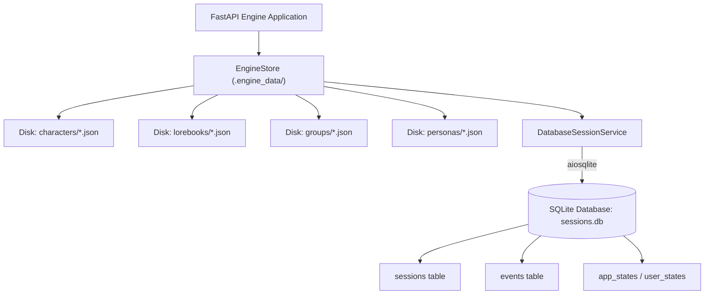
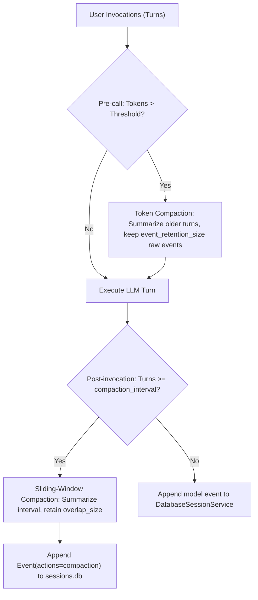

# Database Session Storage, aiosqlite Persistence, and LiteLLM Routing

This guide documents the persistent storage architecture, SQLite table schema, async CRUD mechanics via `aiosqlite`, and LiteLLM failover configuration used by `story_rp_engine`.

---

## 1. Storage Architecture Overview

State management in the Story & Roleplay engine is split across two tiers:
1. **File-based Asset Storage**: Character cards (`characters/{char_id}.json`), lorebooks (`lorebooks/{lorebook_id}.json`), groups (`groups/{group_id}.json`) and personas (`personas/{persona_id}.json`) managed by `EngineStore` (with a DB URL these are the `story_rp_characters`, `story_rp_lorebooks`, `story_rp_groups` and `story_rp_personas` tables instead).
2. **Relational Session & Event Storage**: Conversation history, state deltas, and multi-turn message events managed asynchronously by Google ADK's `DatabaseSessionService` backed by SQLite through `aiosqlite`.



### Storage Directory Structure

By default, the engine establishes its storage directory at `.engine_data/` (configurable via `STORY_RP_STORAGE_DIR`):

```
.engine_data/
├── characters/
│   ├── lyra.json
│   └── elena.json
├── lorebooks/
│   ├── fantasy_world.json
│   └── sci_fi_codex.json
├── groups/
│   └── tavern_regulars.json
├── personas/
│   └── sam.json
└── sessions.db          # SQLite relational database
```

---

## 2. SQLite Database Schema

When configured with an async SQLite URL (`sqlite+aiosqlite:///{storage_dir}/sessions.db`), `DatabaseSessionService` initializes the following tables via SQLAlchemy 2.0 ORM models:

### 2.1 Table: `sessions` (`StorageSession`)
Stores active session metadata, session-level state dictionaries, and optimistic locking revision markers.

| Column | Type | Constraints | Description |
|---|---|---|---|
| `app_name` | VARCHAR | PRIMARY KEY (composite) | Application namespace (`"rp_app"`, `"story_app"` or `"group_app"`). |
| `user_id` | VARCHAR | PRIMARY KEY (composite) | User identifier (e.g. `"User"`, `"Adventurer"`). |
| `id` | VARCHAR | PRIMARY KEY (composite) | Unique session ID (e.g. `"session_123"`, `"story_branch_1"`). |
| `state` | JSON / TEXT | NOT NULL | Serialized session state dictionary (`current_text`, `premise`, `genre`, `tone`, `authors_note`). |
| `create_time` | DATETIME | NOT NULL | UTC timestamp when session was initialized. |
| `update_time` | DATETIME | NOT NULL | UTC timestamp of the most recent event. |
| `update_marker` | VARCHAR | NULLABLE | Monotonic hash/marker used for optimistic locking and stale writer detection. |

### 2.2 Table: `events` (`StorageEvent`)
Stores every interaction turn, model response, and state delta as an ADK `Event`.

| Column | Type | Constraints | Description |
|---|---|---|---|
| `app_name` | VARCHAR | PRIMARY KEY (composite) | Application namespace. |
| `user_id` | VARCHAR | PRIMARY KEY (composite) | User identifier. |
| `session_id` | VARCHAR | PRIMARY KEY (composite) | Foreign key reference to `sessions.id`. |
| `id` | VARCHAR | PRIMARY KEY (composite) | Monotonically incrementing event identifier or UUID. |
| `event_data` | JSON / TEXT | NOT NULL | Full serialized ADK `Event` object: role, content parts, timestamp, partial flags, and actions (`state_delta`). |

### 2.3 Tables: `app_states` & `user_states`
- `app_states`: Stores global application state across all sessions.
- `user_states`: Stores per-user cross-session profile information and preferences.

### 2.4 Conceptual Application Entities

From the application's perspective, the data models map to three primary domain concepts:
- **Sessions**: Isolated narrative threads or roleplay rooms containing metadata and accumulated state.
- **Messages / Turns**: User prompts and assistant responses extracted from `session.events` (`index`, `role`, `text`).
- **Snapshots / State Deltas**: Key-value state changes (`state_delta`) applied during runner turns, such as updating `current_text` or overriding `authors_note`.

---

## 3. Asynchronous CRUD Operations (`aiosqlite`)

All database interactions use `async`/`await` via `DatabaseSessionService`.

### 3.1 Initializing or Fetching a Session

```python
from story_rp_engine.storage.store import EngineStore

store = EngineStore(storage_dir=".engine_data")

# Idempotently retrieve or initialize session
session = await store.get_or_create_session(
    app_name="rp_app",
    user_id="User",
    session_id="session_adventurer_01",
    initial_state={"authors_note": "[Pacing: Fast]"}
)
```

### 3.2 Reading Session Turns & Messages

Chat turns are extracted from `session.events`:

```python
session = await session_service.get_session(
    app_name="rp_app",
    user_id="User",
    session_id=session_id
)

turns = []
if session and session.events:
    for idx, ev in enumerate(session.events):
        text = ""
        if ev.content and ev.content.parts:
            text = "".join(p.text for p in ev.content.parts if getattr(p, "text", None))
        role = getattr(ev.content, "role", "unknown") if ev.content else "system"
        if text:
            turns.append({"index": idx, "role": role, "text": text})
```

### 3.3 Appending Events & State Deltas

During turn execution, the ADK `Runner` automatically calls `append_event`:
1. Acquires an asynchronous mutex lock for `(app_name, user_id, session_id)`.
2. Validates that `session._storage_update_marker` matches the database row (preventing lost updates).
3. Merges `event.actions.state_delta` into `session.state`.
4. Writes the new row to the `events` table.
5. Updates `update_time` and commits the transaction.

### 3.4 History Pruning, Rewinding, and Turn Deletion

Because ADK events form an append-only chain, pruning a turn or rewinding history uses the atomic re-creation pattern:

```python
async def delete_or_truncate_turn(session_service, session_id: str, turn_index: int, truncate: bool):
    session = await session_service.get_session(app_name="rp_app", user_id="User", session_id=session_id)
    if not session:
        return 0

    events = list(session.events)
    if truncate:
        # Rewind to turn_index (discard all subsequent turns)
        events = events[:turn_index] if turn_index >= 0 else []
    else:
        # Delete only single specified turn
        if 0 <= turn_index < len(events):
            events.pop(turn_index)

    # Re-initialize session with preserved state and re-append surviving events
    await session_service.delete_session(app_name="rp_app", user_id="User", session_id=session_id)
    new_session = await session_service.create_session(
        app_name="rp_app",
        user_id="User",
        session_id=session_id,
        state=session.state,
    )
    for ev in events:
        await session_service.append_event(new_session, ev)

    return len(events)
```

---

## 4. LiteLLM Model Provider & Routing Configuration

`story_rp_engine.core.model_provider` instantiates model backends for Google ADK using `LiteLlm`.

### 4.1 Configuration Settings (`EngineConfig`)

| Environment Variable | Default Value | Description |
|---|---|---|
| `STORY_RP_MODEL` | `ollama/llama3.1:8b` | LiteLLM model identifier prefix + name. |
| `STORY_RP_API_BASE` | `http://localhost:11434` | Endpoint URL for local LLM or OpenAI-compatible server. |
| `STORY_RP_API_KEY` | None | API key (defaults to `"local"` if OpenAI-compatible base URL is provided). |
| `STORY_RP_TEMPERATURE` | `0.8` | Sampling temperature. |
| `STORY_RP_TOP_P` | `0.9` | Nucleus sampling probability. |
| `STORY_RP_MAX_TOKENS` | `131072` | Maximum generation token cap. |
| `STORY_RP_MODEL_TIMEOUT_SECONDS` | `120` | Model call timeout; for Gemini it covers the whole reply. |

### 4.2 Auto-Injection of Local API Key
When pointing to local inference servers (vLLM, llama.cpp, LocalAI) via `openai/*` model strings, LiteLLM requires an API key. If none is supplied, the provider automatically injects `"local"`:

```python
api_key = config.api_key
if not api_key and config.api_base and config.model_name.startswith("openai/"):
    api_key = "local"
```

### 4.3 LiteLLM Failover & Fallback Configuration

For high availability and seamless fallback from local SLMs to cloud models, LiteLLM supports router configuration files (`litellm_config.yaml`):

```yaml
model_list:
  - model_name: story-rp-primary
    litellm_params:
      model: ollama/llama3.1:8b
      api_base: http://localhost:11434
      tpm: 100000
      rpm: 600

  - model_name: story-rp-primary
    litellm_params:
      model: openai/meta-llama/Meta-Llama-3.1-8B-Instruct
      api_base: http://localhost:8000/v1
      api_key: local

  - model_name: story-rp-primary
    litellm_params:
      model: openai/gpt-4o-mini
      api_key: os.environ/OPENAI_API_KEY

router_settings:
  routing_strategy: latency-based-routing
  fallbacks:
    - story-rp-primary: ["ollama/llama3.1:8b", "openai/gpt-4o-mini"]
  allowed_fails: 2
  cooldown_time: 30
```

When utilizing a LiteLLM proxy router:
1. Start proxy: `litellm --config litellm_config.yaml --port 4000`
2. Point engine:
   ```bash
   export STORY_RP_MODEL="openai/story-rp-primary"
   export STORY_RP_API_BASE="http://localhost:4000"
   ```

---

## 5. Arize Phoenix OpenTelemetry Tracing

The engine natively integrates Arize Phoenix for trace analysis, latency profiling, and token accounting.

### 5.1 Configuration
Enable tracing in `EngineConfig` via environment variables:
```bash
export PHOENIX_ENABLED=1
export PHOENIX_COLLECTOR_ENDPOINT="http://localhost:6006/v1/traces"
export PHOENIX_PROJECT_NAME="story-rp-engine"
```

### 5.2 Registration Lifecycle
During `create_app()` startup:
```python
if resolved_config.phoenix_enabled:
    from phoenix.otel import register
    register(
        project_name=resolved_config.phoenix_project_name,
        endpoint=resolved_config.phoenix_endpoint,
        auto_instrument=True,
    )
```
Traces capture:
- End-to-end request durations for `/api/v1/rp/chat` and `/api/v1/story/expand`.
- ADK multi-agent workflow DAG execution spans (`story_director` -> `story_writer`).
- LiteLLM token usage, prompt payloads, and generation latency.

---

## 6. Context Compaction and Event Lifecycle

Google ADK 2.x context compaction reduces session memory footprint while maintaining crucial narrative and conversation continuity.



### 6.1 Compaction Configuration
Compaction is configured on `App` via `EventsCompactionConfig`:

```python
from google.adk.apps.app import EventsCompactionConfig
from google.adk.apps.llm_event_summarizer import LlmEventSummarizer
from story_rp_engine.core.model_provider import get_adk_model

model = get_adk_model(config)
summarizer = LlmEventSummarizer(llm=model, prompt_template=config.compaction_prompt_template)

compaction_config = EventsCompactionConfig(
    token_threshold=config.compaction_token_threshold,        # e.g. 4000
    event_retention_size=config.compaction_event_retention_size, # e.g. 5
    compaction_interval=config.compaction_interval,          # e.g. 10
    overlap_size=config.compaction_overlap_size,              # e.g. 2
    summarizer=summarizer,
)
```

### 6.2 SQLite Persistence Semantics
- **No Event Loss**: In SQLite storage, raw user prompts and assistant outputs are **not deleted**. Compaction is append-only: an `Event` with an `EventCompaction` action (`start_timestamp`, `end_timestamp`, `compacted_content`) is appended to the session.
- **In-Memory Prompt Assembly**: When constructing contents for subsequent LLM turns (`google.adk.flows.llm_flows.contents._get_contents`), ADK automatically checks compaction ranges, excludes raw events covered by the compaction window, and substitutes the compacted summary event.
- **Turn Inspection Visibility**: In `GET /api/v1/rp/sessions/{session_id}/turns`, compaction events are surfaced with `role: "compaction"` and `is_compaction: true`, providing clients full transparency into the compacted history.

