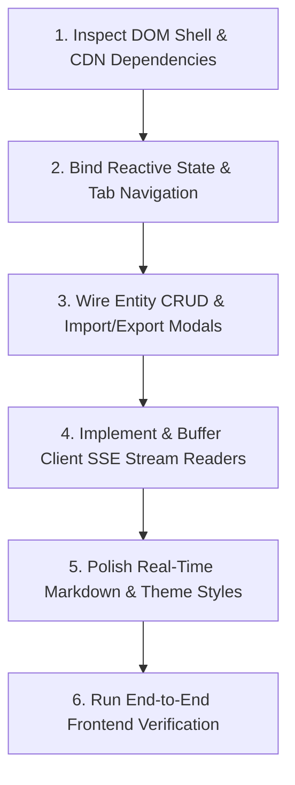

# Story & RP Frontend Skill

Operational guide and guardrails for developing, maintaining, styling, and debugging the single-page browser interface in `src/story_rp_engine/web/` (`index.html`, `app.js`, `style.css`), including tab switching across the roleplay, group chat and story workbenches, client-side SSE event stream readers, Character Card V2, Group and Lorebook managers, and Markdown rendering.

---

## Workflow: Method Ladder

Follow these sequential steps when building, modifying, or troubleshooting the frontend workbench:



### 1. Inspect DOM Shell & CDN Dependencies
- Verify that `src/story_rp_engine/web/index.html` loads necessary CDN runtime libraries:
  - Vue 3 (`unpkg.com/vue@3/dist/vue.global.prod.js`)
  - Tailwind CSS (`cdn.tailwindcss.com`)
  - Lucide Icons (`unpkg.com/lucide@latest`)
  - Marked.js (`cdn.jsdelivr.net/npm/marked/marked.min.js`)
- Ensure the root Vue mounting element has `#app` and the `v-cloak` directive to prevent uncompiled template flashing.
- Consult `references/ui-components-and-modes.md` for HTML hierarchy, responsive flex/grid layouts, and Lucide icon bindings.

### 2. Bind Reactive State & Tab Navigation
- Maintain centralized Vue 3 reactive state in `src/story_rp_engine/web/app.js` (`AppDefinition`):
  - Global navigation: `activeTab` (`'roleplay'`, `'group'`, `'story'`, `'characters'`, `'groups'`, `'lorebooks'`). `'group'` is the Group Chat tab and `'groups'` is the Groups editor.
  - Application health: `backendOnline` toggled via `checkHealth()` polling `/health` every 10 seconds.
  - Toast feedback: `toast` object with auto-dismiss timer.
- Keep bidirectional watchers in sync for property aliases (e.g., `charSearchQuery` <-> `charSearch`, `lorebookSearchQuery` <-> `lbSearch`, `customGenre` <-> `storyCustomGenre`, `customTone` <-> `storyCustomTone`).
- Consult `references/ui-components-and-modes.md` for complete data properties, computed filters, and lifecycle methods.

### 3. Wire Entity CRUD & Import/Export Modals
- **Character Cards**:
  - Load list via `GET /api/v1/characters` and detail via `GET /api/v1/characters/{id}`.
  - Save via `POST /api/v1/characters` and delete via `DELETE /api/v1/characters/{id}`.
  - Support both Tavern V2 format (`{ spec: "chara_card_v2", data: { ... } }`) and flat cards in `importCharacterJSON()` and `exportCharacterJSON()`.
- **Lorebooks**:
  - Load codices via `GET /api/v1/lorebooks` and detail via `GET /api/v1/lorebooks/{id}`.
  - Bind dynamic entries array with `enabled`, `insertion_order`, `keys_str`, and `content`.
  - Save via `POST /api/v1/lorebooks` and delete via `DELETE /api/v1/lorebooks/{id}`.
- **Groups** (Groups tab):
  - Load via `GET /api/v1/groups` into `groups` (keyed by `group_id`); save via `POST /api/v1/groups` and delete via `DELETE /api/v1/groups/{id}`.
  - `groupForm` holds `group_id`, `name`, `char_ids` (toggled with `toggleGroupMember`; selection order is the fallback speaking order), `scenario` and `lorebook_ids`. Groups have no opening message: the user's first message opens the scene.
- Consult `references/ui-components-and-modes.md` for form fields, validation requirements, and JSON mapping schemas.

### 4. Implement & Buffer Client SSE Stream Readers
- Consume streaming endpoints via `fetch` with `ReadableStream`, `TextDecoder`, and `AbortController`:
  - Roleplay Chat: `POST /api/v1/rp/chat/stream` appending tokens to `rpMessages`.
  - Story Co-Pilot: `POST /api/v1/story/expand/stream` appending prose to the latest assistant turn in `storyMessages`.
  - Group Chat: `POST /api/v1/group/chat/stream` in `_streamGroupReplies`; each delta carries `speaker` (a `char_id`), and a new bubble in `groupMessages` opens whenever the speaker changes. Labels come from `characterName(speaker)`.
- Buffer incoming bytes across packet chunks, split on `\n\n` boundaries, parse `data: {...}` JSON deltas, and skip the `data: [DONE]` sentinel.
- Flush any remaining buffer text after stream termination.
- Consult `references/sse-event-client.md` for stream reader implementation, chunk buffering loops, and abort handling.

### 5. Polish Real-Time Markdown & Theme Styles
- Parse streamed assistant tokens into sanitized HTML via `renderMarkdown()` using Marked.js, providing an escaped plain-text fallback on error.
- Animate streaming progress with `.cursor-blink` CSS keyframes.
- Ensure auto-scrolling via `scrollRPChatToBottom()` triggered inside Vue's `$nextTick()`.
- Maintain dark-mode scrollbars (`::-webkit-scrollbar`) and prose typography (`.prose-dark`) in `src/story_rp_engine/web/style.css`.
- Consult `references/ui-components-and-modes.md` and `references/sse-event-client.md` for styling classes and animation definitions.

### 6. Run End-to-End Frontend Verification
- Run automated tests verifying HTML template mounting, static assets delivery, API integration, and SSE token chunk consumption:
  ```bash
  uv run pytest tests/test_web_mount.py tests/test_frontend_integration.py -v
  ```

---

## Critical Guardrails

1. **Zero-Build CDN Architecture Integrity**:
   - The frontend is intentionally zero-build and runs directly from browser script tags. Do not introduce npm build steps, webpack, Vite, or TypeScript compilation to `src/story_rp_engine/web/` without explicit architectural mandate.
2. **Strict SSE Chunk Buffering & Flushes**:
   - Never assume an incoming stream chunk contains an entire SSE frame. Always buffer incoming chunks, split on `\n\n`, keep the trailing fragment in the buffer, and flush remaining buffer content when `done === true`.
3. **Turn Offset Alignment for Greetings**:
   - In roleplay mode, the initial assistant greeting (`first_mes`) is displayed in the UI as `rpMessages[0]` with `isGreeting: true` before any messages are sent to the backend. When deleting turns (`deleteTurn`, `deleteFromHere`, `regenerateTurn`), offset backend turn indices by -1 (`backendIndex = hasGreeting ? index - 1 : index`) so backend event indices remain synchronized. Group Chat has no greeting, so `deleteGroupTurn` sends the UI index as is.
4. **Graceful Interruptibility (`AbortController`)**:
   - The RP, Group Chat and Story streaming readers must each maintain an active `AbortController`. Clicking "Stop Generating" must abort the fetch signal and catch `AbortError` cleanly without erasing partial text already received.
5. **Dynamic Icon Lifecycle Synchronization**:
   - Lucide icons dynamically injected or rendered in Vue conditional blocks (`v-if`, `v-show`, `v-for`) must be re-rendered via `lucide.createIcons()` inside Vue's `updated()` hook or helper `refreshIcons()` with `$nextTick()`.
6. **Robust Markdown Sanitization & Fallback**:
   - Never allow unhandled exceptions in `marked.parse()` to crash Vue component rendering. `renderMarkdown()` must enclose parsing in a `try/catch` block and fall back to HTML entity escaping (`&`, `<`, `>`, `"`) with `\n` to `<br>` conversion.
7. **Two-Way Watcher Synchronization**:
   - When introducing search filters or custom dropdown options, maintain two-way synchronization between primary state keys and backwards-compatible aliases (e.g., `charSearchQuery` and `charSearch`).
8. **Story Mode Is a Chat**:
   - The first story turn comes from the setup card (premise, genre, tone, opening instruction) and is the only turn that sends the setup fields; follow-ups send only `instruction`. The backend builds the story text from the session, so the client never sends it.

---

## Verification Commands

Validate the `story-rp-frontend` skill and web workbench:

```bash
# 1. Run agent skills validation for story-rp-frontend
uv run pytest tests/test_agent_skills.py -k "story-rp-frontend" -v

# 2. Run static assets and mount tests
uv run pytest tests/test_web_mount.py -v

# 3. Run frontend and API integration test suite
uv run pytest tests/test_frontend_integration.py -v

# 4. Run all agent skills validation tests
uv run pytest tests/test_agent_skills.py -v
```

---

## Reference Guides

Detailed technical specifications are available in the 1-level deep references:
- `references/ui-components-and-modes.md`: HTML layout hierarchy, the six tabs (Roleplay, Group Chat, Story Co-Pilot, Characters, Groups, Lorebooks), character card importer modal/editor, lorebook and group editors, CSS variables, and theme styling.
- `references/sse-event-client.md`: Client-side SSE reader via `fetch` ReadableStream / `TextDecoder` (including the group chat `speaker` deltas), chunk buffering, real-time Markdown rendering, disconnect/error handling, AbortController cancellation, and turn rewind/regeneration mechanics.
