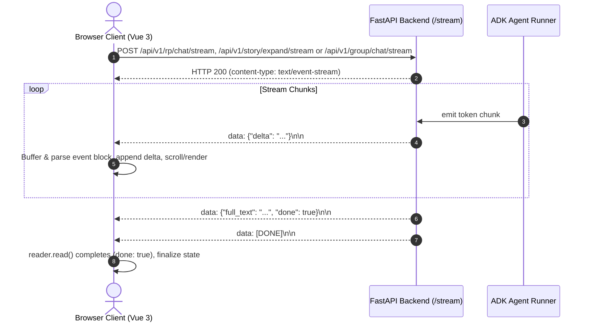

# Client-Side Server-Sent Events (SSE) Streaming Reader

Technical reference for client-side Server-Sent Events (SSE) event streaming, ReadableStream decoding, chunk buffering, Markdown rendering, error recovery, and stream interruption in `src/story_rp_engine/web/app.js`.

---

## 1. Overview & Streaming Architecture

The web interface communicates with the FastAPI backend via HTTP `POST` requests returning `text/event-stream` payloads. Unlike native `EventSource` (which is restricted to HTTP `GET`), the frontend employs the Fetch API with `ReadableStream`, `TextDecoder`, and `AbortController`.



---

## 2. ReadableStream Consumption & Chunk Buffering Pattern

Because TCP packets and network chunks do not align neatly with SSE event frames (`\n\n`), the client must maintain a continuous string buffer to handle fragmented packets and multi-byte UTF-8 sequences.

### Implementation Pattern (`app.js`)

```javascript
const reader = res.body.getReader();
const decoder = new TextDecoder('utf-8');
let buffer = '';

while (true) {
  const { done, value } = await reader.read();
  if (done) break;

  // Decode incoming Uint8Array with stream: true to preserve multi-byte characters
  buffer += decoder.decode(value, { stream: true });
  buffer = buffer.replace(/\r\n/g, '\n');

  // Split on double newline (SSE event boundary)
  const events = buffer.split('\n\n');
  // Retain incomplete trailing fragment in the buffer
  buffer = events.pop();

  for (const block of events) {
    const trimmed = block.trim();
    if (!trimmed) continue;

    for (const line of trimmed.split('\n')) {
      const l = line.trim();
      if (l.startsWith('data:')) {
        const rawData = l.slice(5).trim();
        if (rawData === '[DONE]') {
          continue; // Termination sentinel
        }

        try {
          const data = JSON.parse(rawData);
          // Handle incremental token deltas
          if (data.delta) {
            targetContainer.text += data.delta;
          } else if (data.full_text && !targetContainer.text) {
            targetContainer.text = data.full_text;
          }
        } catch (jsonErr) {
          // Ignore malformed chunk or partial JSON
        }
      }
    }
  }
}

// Flush any remaining buffered data after stream terminates
if (buffer && buffer.trim()) {
  for (const line of buffer.trim().split('\n')) {
    const l = line.trim();
    if (l.startsWith('data:')) {
      const rawData = l.slice(5).trim();
      if (rawData !== '[DONE]') {
        try {
          const data = JSON.parse(rawData);
          if (data.delta) targetContainer.text += data.delta;
        } catch (_) {}
      }
    }
  }
}
```

---

## 3. Streaming Endpoints Comparison

The application provides three streaming workflows: roleplay turns, group chat turns and narrative story generation:

| Characteristic | Roleplay Chat (`_streamAssistantReply`) | Group Chat (`_streamGroupReplies`) | Story Co-Pilot (`_streamStoryReply`) |
| :--- | :--- | :--- | :--- |
| **Endpoint** | `POST /api/v1/rp/chat/stream` | `POST /api/v1/group/chat/stream` | `POST /api/v1/story/expand/stream` |
| **Request Model** | `RPStreamChatRequest` (`char_id`, `session_id`, `message`, `authors_note`, `persona_id` (or `user_name`), `chunk_size`) | `GroupChatRequest` (`group_id`, `session_id`, `message`, `authors_note`, `persona_id` (or `user_name`), `lorebook_ids`, `chunk_size`) | `StoryRequest` (`session_id`, `instruction`, `chunk_size`; `premise`, `genre`, `tone` on the first turn only) |
| **Target Destination** | Appends to assistant turn in `rpMessages` array | Opens a new bubble in `groupMessages` whenever the delta's `speaker` changes | Appends to assistant turn in `storyMessages` array |
| **Cancellation** | `this.rpAbortController.abort()` | `this.groupAbortController.abort()` | `this.storyAbortController.abort()` |
| **UI Indicator** | Animated `▌` cursor inside active bubble | Animated `▌` cursor inside the last bubble | Animated `▌` cursor inside active bubble |

---

## 4. Wire Protocol Event Schemas

The client recognizes three standard payload schemas over the SSE channel:

### 1. Token Delta Event
Carries partial token chunks buffered according to the client-requested `chunk_size`:
```text
data: {"delta": "The silver mist drifted silently across the hollow."}

```

### 2. Consolidated Completion Event
Contains the fully assembled generation and status flag:
```text
data: {"full_text": "Complete generated text...", "done": true}

```

### 3. Termination Sentinel
Indicates stream termination; signals client loop completion:
```text
data: [DONE]

```

### 4. Group Chat Variant
`/api/v1/group/chat/stream` adds the speaking character's `char_id` to every delta and ends with a `replies` list instead of `full_text`. A change of `speaker` means the next character has started, so the client opens a new bubble:
```text
data: {"speaker": "mara", "delta": "Not tonight, darling."}

data: {"speaker": "siqi", "delta": "A gull fought the gale by the crane."}

data: {"replies": [{"speaker": "mara", "text": "Not tonight, darling."}, {"speaker": "siqi", "text": "A gull fought the gale by the crane."}], "done": true}

data: [DONE]

```

---

## 5. User Experience & Real-Time Polish

### Smooth Autoscrolling
During chat generation, new tokens expand the feed height. `scrollRPChatToBottom()` runs within Vue's `$nextTick()` to smoothly keep the latest generated text visible:
```javascript
scrollRPChatToBottom() {
  this.$nextTick(() => {
    if (typeof document !== 'undefined') {
      const feed = document.getElementById('rp-chat-feed');
      if (feed) {
        feed.scrollTop = feed.scrollHeight;
      }
    }
  });
}
```

### Real-Time Markdown Rendering (`renderMarkdown`)
Chat bubbles pass raw streamed text through Marked.js:
- Sanitizes and parses markdown headings, lists, bold text, italics, and code fences.
- Provides a secure plain-text fallback replacing HTML entities (`&`, `<`, `>`, `"`) and mapping `\n` to `<br>` if Marked.js is unavailable or parsing fails.

---

## 6. Interruptibility & Session Rewind Mechanics

### Client-Initiated Abort (`AbortController`)
Users can halt token generation immediately by clicking **Stop Generating**:
1. Invokes `controller.abort()`.
2. The fetch stream rejects with `DOMException: The user aborted a request.` (or `AbortError`).
3. The catch block gracefully intercepts `err.name === 'AbortError'`:
   - Preserves whatever partial text was already streamed.
   - Cleans up active generation flags (`isGeneratingRP = false`, `isGeneratingStory = false`).
   - Dismisses pending spinners and restores send button availability.

### Turn Regeneration (`regenerateTurn`)
When regenerating the last assistant response:
1. Locates the preceding user turn in `rpMessages`.
2. Offsets for unpersisted initial greeting (if `rpMessages[0].isGreeting`, `backendIndex = userIdx - 1`).
3. Calls `POST /api/v1/rp/sessions/{id}/turns/delete` with `turn_index: backendIndex, truncate_subsequent: true` to prevent duplicating history on the backend.
4. Removes the assistant bubble from the Vue state.
5. Re-initiates `_streamAssistantReply(priorUserText)`.

### Turn Rewind (`deleteFromHere`)
When clicking "Rewind from here" on turn $N$:
1. Prompts confirmation (`confirm()`).
2. Calls backend turn deletion with `truncate_subsequent: true`.
3. Truncates the reactive frontend message array: `this.rpMessages.splice(index)`.
