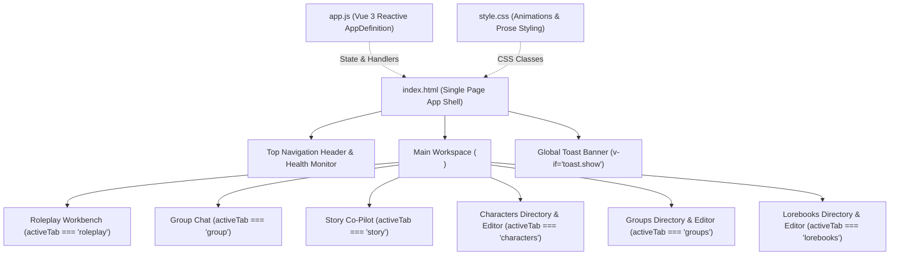
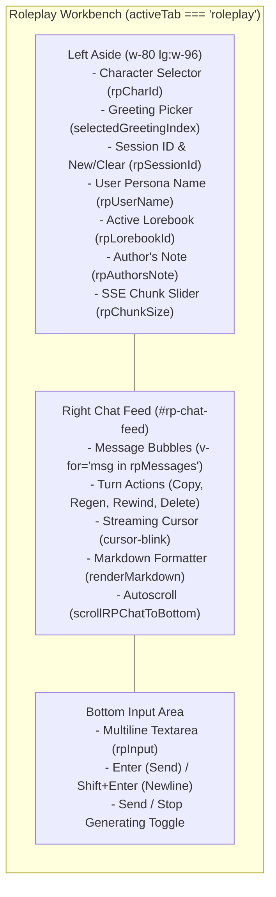
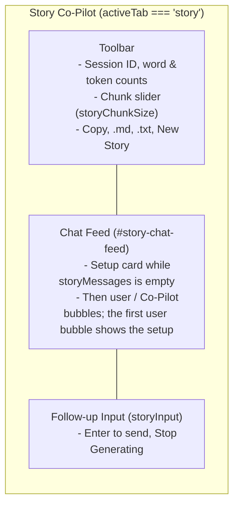

# Web UI Components and Tabs

Technical reference for the single-page application (SPA) browser interface in `src/story_rp_engine/web/` (`index.html`, `app.js`, `style.css`).

---

## 1. Application Architecture & Technology Stack

The Story and Roleplay Workbench is implemented as a lightweight, zero-build-step client-side SPA. It directly executes in modern browsers by loading core libraries via CDN:

- **Vue 3 (`vue.global.prod.js`)**: Reactive state tree, template bindings, computed filtering, watchers, and lifecycle hooks (`mounted`, `updated`, `beforeUnmount`).
- **Tailwind CSS (`cdn.tailwindcss.com`)**: Utility-first responsive design, dark mode theme palette (`neutral-950`, `neutral-900`, `neutral-800`), and indigo accent accents (`indigo-600`, `indigo-500`).
- **Lucide Icons (`lucide@latest`)**: SVG iconography dynamically rendered through `lucide.createIcons()` triggered in Vue lifecycle updates.
- **Marked.js (`marked.min.js`)**: Real-time client-side Markdown parser converting streamed LLM tokens into sanitized HTML for chat bubbles and prose canvases.
- **Custom Stylesheet (`style.css`)**: Custom dark scrollbars, streaming cursor animation (`cursor-blink`), typography styling (`prose-dark`), and input focus states.



---

## 2. Top Header & Navigation Bar

Located at `<header class="h-14 border-b border-neutral-800 bg-neutral-900/90 backdrop-blur px-4">`:

### Components
1. **App Branding**:
   - Icon with indigo gradient badge (`lucide="sparkles"`).
   - Title: **Story & Roleplay Workbench** (`text-sm md:text-base font-bold`).
   - Subtitle: `ADK Dual-Engine Playground` (`text-[10px] font-mono text-neutral-400`).
2. **Navigation Tabs**:
   - Six tab buttons, in this order:
     - `roleplay` (`lucide="message-square"`)
     - `group` (`lucide="messages-square"`, Group Chat)
     - `story` (`lucide="feather"`)
     - `characters` (`lucide="users"`)
     - `groups` (`lucide="contact"`, Groups editor)
     - `lorebooks` (`lucide="book-open"`)
   - Active tab state indicated by `bg-indigo-600 text-white font-medium shadow-sm`.
3. **Backend Health Indicator**:
   - Status badge polling `/health` every 10 seconds via `setInterval` in `mounted()`.
   - Green pulsing dot (`bg-emerald-500`) and `"Backend: Online"` when `res.ok`.
   - Red dot (`bg-rose-500`) and `"Backend: Disconnected"` on fetch failure or non-200 status.

---

## 3. Tab 1: Roleplay Workbench (`roleplay`)

A full-featured conversational roleplay client supporting Character Card V2 personas, dynamic greetings, session isolation, and turn actions.



### Left Sidebar Controls
- **Active Character Selector (`rpCharId`)**: Populated from `characters` array. Triggers `onRPCharChange()` to update default opener greeting in the dialogue feed.
- **Alternate Greetings Picker (`selectedGreetingIndex`)**: Shown when `selectedCharAlternateGreetings.length > 0`. Triggers `onGreetingChange()` to swap the initial greeting message without resetting user chat turns.
- **Session Controls**:
  - `rpSessionId`: Reactive session identifier string (`sess_<random>`).
  - **New (`newRPSession()`)**: Aborts any active generation, generates a fresh session ID, clears `rpMessages`, and repopulates the active character's greeting.
  - **Clear (`clearRPSession()`)**: Calls `DELETE /api/v1/rp/sessions/{session_id}` on the backend and empties `rpMessages`.
- **User Persona Name (`rpUserName`)**: String injected into the turn request payload (default `"User"`).
- **Active Lorebook Association (`rpLorebookId`)**: Dropdown linking world info codex entries for keyword retrieval.
- **Author's Note (`rpAuthorsNote`)**: Injected prompt steering placed at depth into the system prompt.
- **SSE Chunk Size Slider (`rpChunkSize`)**: Token chunk buffering range (1–64 tokens, default 16).

### Right Chat Dialogue Feed
- **Message List (`rpMessages`)**:
  - User turns: Right-aligned, indigo tinted (`bg-indigo-950/40 border-indigo-800/50`).
  - Assistant turns: Left-aligned, dark neutral (`bg-neutral-900/90 border-neutral-800`).
- **Turn Actions Toolbar (hover-activated)**:
  - **Copy (`copyMessage(msg.content)`)**: Copies message text via `navigator.clipboard.writeText` with textarea fallback.
  - **Regenerate (`regenerateTurn(idx)`)**: Rewinds backend session to before the preceding user turn, deletes the assistant message, and initiates `_streamAssistantReply()`.
  - **Rewind & Delete From Here (`deleteFromHere(idx)`)**: Calls `POST /api/v1/rp/sessions/{id}/turns/delete` with `truncate_subsequent: true` and truncates `rpMessages.splice(idx)`.
  - **Delete Single Turn (`deleteTurn(idx)`)**: Calls `POST /api/v1/rp/sessions/{id}/turns/delete` with `truncate_subsequent: false` and removes the turn from `rpMessages`.
- **Bottom Input Area**:
  - Textarea (`rpInput`) with `@keydown.enter.exact.prevent="sendRPMessage"`.
  - Stop Generating button (`stopGeneratingRP()`) using `AbortController.abort()`.

---

## 4. Tab 2: Story Co-Pilot Workbench (`story`)

A collaborative multi-agent creative writing environment interfacing with Google ADK 2.0 `story_director` and `story_writer` agents.



### Setup Card (first turn)
Shown in the feed while `storyMessages` is empty. `startStory()` sends the setup with the opening instruction; the backend keeps the setup in session state.
- **Premise (`storyPremise`)**: Overarching narrative context or world setup.
- **Genre Selector (`storyGenre`, `customGenre`)**:
  - Presets: Fiction, Fantasy, Sci-Fi, Cyberpunk, Mystery, Horror, Romance, Slice of Life, Custom.
  - Computed `effectiveGenre` resolves custom input when "Custom" is selected.
- **Tone Selector (`storyTone`, `customTone`)**:
  - Presets: Balanced, Gritty, Dark, Whimsical, Tense, Poetic, Sensual, Epic, Custom.
  - Computed `effectiveTone` resolves custom input.
- **Opening Instruction (`storyInstruction`)**: How the story should begin (defaults to "Begin the story.").

### Chat Turns & Toolbar
- **Follow-ups (`sendStoryMessage()`)**: Each message is the next turn's `instruction`: continue, steer or revise.
- **Streaming (`_streamStoryReply()`)**: Posts to `/api/v1/story/expand/stream` and appends deltas to a new Co-Pilot bubble.
- **Story text (`storyText`)**: The Co-Pilot replies joined in order; it drives `wordCount`, `estimatedTokens` (`Math.round(wordCount * 1.3)`), Copy and export.
- **Exporting**: `.md` / `.txt` downloads of `storyText` via `Blob` and `URL.createObjectURL`.
- **New Story (`newStorySession()`)**: New `storySessionId`, empty chat, setup card again.

---

## 5. Tab 3: Characters Management (`characters`)

Full CRUD management for Character Card V2 JSON definitions compliant with the Tavern specification.

### Layout & Features
- **Sidebar Directory**:
  - Search filter input (`charSearchQuery` / `charSearch`).
  - Filtered list cards showing name, slug ID, truncated description, and badge tags.
  - **New Character (`newCharacter()`)**: Clears form to blank defaults.
  - **Import JSON (`importCharacterJSON()`)**: Reads `.json` files via `FileReader`. Automatically detects Tavern V2 format (`{ spec: "chara_card_v2", data: { ... } }`) or flat JSON cards.
  - **Export JSON (`exportCharacterJSON()`)**: Serializes card fields into formatted JSON blob and triggers file download.
- **Form Editor Sections**:
  1. **Identity & Tags**: `char_id` (slug), `name` (display name), `tags` (comma-separated).
  2. **Persona & World**: `description` (visuals/bio), `personality` (traits/speech quirks), `scenario` (setting/relationship).
  3. **Dialogue & Openers**: `first_mes` (default opening narrative), `alternate_greetings` (dynamic array with Add/Remove buttons), `mes_example` (`<START>\n{{user}}: ...\n{{char}}: ...`).
  4. **Advanced Prompts & Notes**: `system_prompt` (override), `post_history_instructions` (post-history directives), `creator_notes` (author notes).
  5. **Actions**: Save Character (`POST /api/v1/characters`), Delete Character (`DELETE /api/v1/characters/{id}`).

---

## 6. Tab 4: Lorebooks Management (`lorebooks`)

Codex manager for keyword-triggered world context entries injected dynamically during conversation turns.

### Layout & Features
- **Sidebar Directory**:
  - Search filter input (`lorebookSearchQuery` / `lbSearch`).
  - Displays title, entry count badge, and overview description.
  - **New Lorebook (`newLorebook()`)**: Clears editor for new codex.
  - **Import JSON (`importLorebookJSON()`)**: Parses SillyTavern or Agnaistic lorebook structures (`entries` dictionary or list).
  - **Export JSON (`exportLorebookJSON()`)**: Generates structured lorebook JSON file for download.
- **Form Editor Sections**:
  1. **Codex Metadata**: Lorebook title (`name`), setting description (`description`).
  2. **Lore Entries Manager**:
     - Dynamic array of entries with Add Entry (`addEntry()`) and Delete Entry (`removeEntry(idx)`).
     - Per-entry toggles: `enabled` checkbox, `insertion_order` number input (priority in prompt stack).
     - `keys_str`: Comma-separated trigger keywords (e.g. `eldoria, kingdom, capital`).
     - `content`: World info prose injected when triggers match dialogue context.
  3. **Actions**: Save Lorebook (`POST /api/v1/lorebooks`), Delete Lorebook (`DELETE /api/v1/lorebooks/{id}`).

---

## 7. Group Chat (`group`)

Chat with a saved group of characters. Each turn the backend's speaker selector picks who replies, and every reply streams into its own labelled bubble.

### Left Sidebar Controls
- **Active Group** (`groupChatId`): `<select>` over `groups`; changing it calls `onGroupChatChange()`, which starts a new chat and reloads history. The member names show under the picker.
- **Chat**: "New" (`newGroupSession()`, which seeds the group's `first_mes` as an `isGreeting` bubble and preselects its default lorebook) and a history dropdown (`groupSessions` from `GET /api/v1/group/sessions?group_id=`) with open, rename (`saveRename('group', s)`) and delete (`deleteGroupSession(s)`).
- **User Persona Name** (`groupUserName`), **Active Lorebook** (`groupLorebookId`, sent only when the session or selection changed, tracked by `groupLorebookSentKey`), **Author's Note** (`groupAuthorsNote`) and **SSE Chunk Size** (`groupChunkSize`).

### Right Chat Feed (`#group-chat-feed`)
- `groupMessages` entries are `{ role, speaker, content, timestamp, isGreeting? }`; `speaker` is a `char_id` (null for the user and the greeting).
- Bubble labels come from `groupSpeakerName(msg)`: the user name, the group name for the greeting, otherwise `characterName(msg.speaker)`.
- `_streamGroupReplies()` posts to `POST /api/v1/group/chat/stream` and opens a new bubble whenever a delta's `speaker` changes.
- Each bubble has Copy and Delete (`deleteGroupTurn(idx)`, which posts `turns/delete` with the greeting offset). There is no regenerate or rewind.
- Reopening a chat (`openGroupSession(s)`) rebuilds the bubbles from `GET /api/v1/group/sessions/{id}/turns`.

---

## 8. Groups Management (`groups`)

Editor for saved groups of characters.

### Layout & Features
- **Sidebar Directory**:
  - Search filter input (`groupSearchQuery`, filtered by `filteredGroups` over name, ID and scenario).
  - Cards show the group name, member count and member names (`characterName`).
  - **New Group (`newGroup()`)**: Clears the form.
- **Form Editor** (`groupForm`):
  1. **Identity**: `group_id` (slug) and `name`.
  2. **Members**: a grid of saved characters; clicking toggles membership (`toggleGroupMember(char_id)`), and the badge number is the selection order, which is the fallback speaking order.
  3. **Scene**: `scenario` (replaces each member's own scenario in group chats) and `first_mes` (opening message).
  4. **Default Lorebook**: `lorebook_id`, preselected for new chats.
  5. **Actions**: Save Group (`POST /api/v1/groups`), Delete Group (`DELETE /api/v1/groups/{id}`).

---

## 9. CSS Custom Properties and Theme Styling (`style.css`)

### Core Rules
- **Directive Cloaking**:
  ```css
  [v-cloak] {
    display: none !important;
  }
  ```
  Prevents uncompiled Vue mustache templates from flashing on slow script initialization.

- **Dark Mode Scrollbars**:
  ```css
  ::-webkit-scrollbar { width: 7px; height: 7px; }
  ::-webkit-scrollbar-track { background: #0a0a0a; }
  ::-webkit-scrollbar-thumb { background: #262626; border-radius: 4px; }
  ::-webkit-scrollbar-thumb:hover { background: #404040; }
  * { scrollbar-width: thin; scrollbar-color: #262626 #0a0a0a; }
  ```

- **Streaming Cursor Animation**:
  ```css
  @keyframes blink {
    0%, 100% { opacity: 1; }
    50% { opacity: 0; }
  }
  .cursor-blink {
    display: inline-block;
    color: #6366f1;
    font-weight: 700;
    animation: blink 0.9s cubic-bezier(0.4, 0, 0.6, 1) infinite;
  }
  ```

- **Markdown Typography (`prose-dark`)**:
  - Clean paragraph spacing (`margin-bottom: 0.75rem`).
  - Dialogue action text in muted italics (`color: #a3a3a3; font-style: italic`).
  - Code blocks (`background: #171717; border: 1px solid #262626; border-radius: 0.375rem;`).
  - Blockquotes with indigo border (`border-left: 3px solid #6366f1; padding-left: 0.75rem;`).

- **Focus Ring States**:
  ```css
  input:focus, textarea:focus, select:focus {
    outline: none;
    box-shadow: 0 0 0 2px rgba(99, 102, 241, 0.35);
    border-color: #6366f1 !important;
  }
  ```
