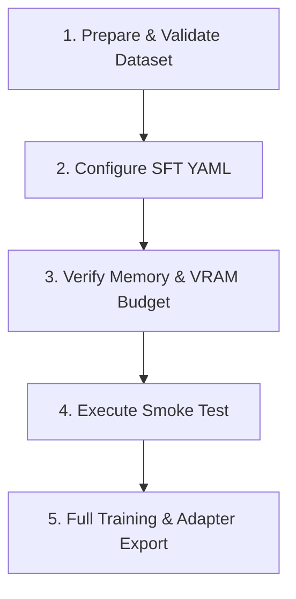

# Unsloth SFT Post-Training Skill

Operational instructions and guardrails for running Supervised Fine-Tuning (SFT) on Small Language Models (SLMs) and Vision-Language Models (VLMs) using Unsloth and TRL.

---

## Workflow: Method Ladder

Follow these sequential steps when setting up or modifying SFT workflows:



### 1. Prepare & Validate Dataset
- Format data in conversational Hugging Face `conversations` or ShareGPT structure.
- Verify user/assistant alternating turns and system prompt alignment.
- Consult `references/dataset-formatting.md` for role mapping rules and auto-conversion behavior.

### 2. Configure SFT YAML
- Create or update a configuration file under `configs/sft/` (e.g. `configs/sft/my_task.yaml`).
- Set `stage: sft` at root level.
- Configure `model` (e.g. `load_in_4bit: true`, `max_seq_length: 2048`), `lora` targets, `dataset`, `training`, and `output`.
- Consult `references/sft-config-schema.md` for the complete field dictionary and default values.

### 3. Verify Memory & VRAM Budget (<= 8GB VRAM)
- Ensure `load_in_4bit: true` is active for QLoRA.
- Keep `use_gradient_checkpointing: "unsloth"` in the `lora` block to prevent activation memory spikes.
- Use `optim: "adamw_8bit"` or `"paged_adamw_8bit"`.
- Set `batch_size: 1` or `2` with `gradient_accumulation_steps: 4` or `8`.
- Cap `max_seq_length` at 2048 tokens.

### 4. Execute Smoke Test
- Always run a 2-step verification smoke test prior to launching long training runs:
  ```bash
  uv run slm-post-train train --config configs/sft/smoke_test.yaml
  ```
- Check logs for successful model loading, tokenizer template application, and loss decrease.

### 5. Launch Full Training Run
- Run training with target configuration:
  ```bash
  uv run slm-post-train train --config configs/sft/gemma_text_sft.yaml
  ```
- Monitor loss curves via Weights & Biases (WandB).
- Output LoRA adapter checkpoints are saved to `outputs/<output_dir>/<timestamp>`.

---

## Critical Guardrails

1. **Always Mask Instruction Tokens**:
   - `training.train_on_responses_only` must be `true` for standard chat datasets.
   - Unsloth masks instruction tokens with `-100` so loss is only calculated on assistant completions.
2. **Packing Incompatibility**:
   - Never set `packing: true` when `train_on_responses_only: true` is enabled. Packing concatenates multiple samples across sequence boundaries, which breaks turn delimiter loss masking.
3. **Hardware Memory Protection**:
   - On GPUs with <= 8 GB VRAM, never train full weights or 16-bit LoRA without 4-bit quantization (`load_in_4bit: true`).
   - If encountering CUDA Out of Memory (OOM), reduce `batch_size` to 1, reduce `target_modules` to attention projections only (`["q_proj", "k_proj", "v_proj", "o_proj"]`), or reduce `max_seq_length`.
4. **Data & Artifact Hygiene**:
   - Training datasets must reside in `data/` and model outputs in `outputs/`.
   - Never commit raw datasets, model weights, or adapter binaries to version control.

---

## Verification Commands

Validate the SFT environment and configuration:

```bash
# 1. Verify SFT runner module imports and template definitions
uv run python -c "from slm_post_train.trainers.sft_runner import run_sft, CHAT_TEMPLATE_DELIMITERS; print(f'SFT Runner loaded. Supported templates: {len(CHAT_TEMPLATE_DELIMITERS)}')"

# 2. Run test harness validation
uv run pytest tests/test_agent_skills.py -k unsloth -v

# 3. Non-destructive smoke test (requires GPU or mock environment)
uv run slm-post-train train --config configs/sft/smoke_test.yaml
```

---

## Reference Guides

Deep documentation is available in the 1-level deep references:
- `references/sft-config-schema.md`: Complete YAML schema definition, field descriptions, parameter options, and VRAM budgeting guidelines.
- `references/dataset-formatting.md`: Conversational ShareGPT/HF format specification, loss masking mechanics, and delimiter tables.
