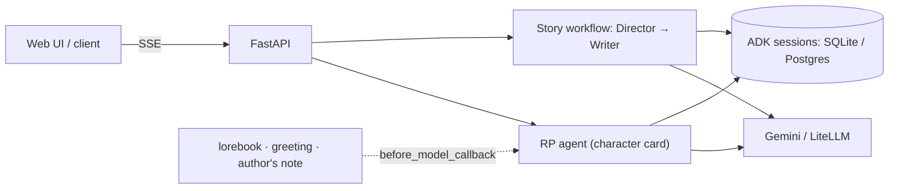

# SLM/VLM Post-Training + Story & Roleplay Engine

Two packages in one repo:

- **`slm_post_train`**: SFT and GRPO post-training for small text and vision models with Unsloth + TRL, sized to fit **≤ 8 GB VRAM**, with export to GGUF for Ollama / llama.cpp.
- **`story_rp_engine`**: a story co-pilot and character roleplay backend built on **Google ADK 2** and **FastAPI**, which can serve the models you train.

## Highlights

**Post-training**
- **SFT with responses-only loss**: prompt tokens are masked, so gradients come only from completions.
- **GRPO** with pluggable rewards via `@register_reward`. Built-in rewards: `xml_format` (`<think>/<answer>` structure), `exact_match`, and `code_execution` (sandboxed subprocess with a timeout).
- **Fits 2B–9B models in 8 GB**: 4-bit QLoRA, Unsloth gradient checkpointing, and 8-bit / paged AdamW.
- **Export**: LoRA adapter, merged 16-bit or 4-bit checkpoints, or GGUF (`q4_k_m`, `q8_0`, `f16`, …).

**Story & roleplay engine**
- **Roleplay**: Character Card V2 fields, `{{char}}`/`{{user}}` macros, and per-turn context added through an ADK `before_model_callback`: keyword-triggered lorebook entries, the opening greeting, and an author's note.
- **Story co-pilot**: an ADK `Workflow` graph where a **Director** frames the scene and a **Writer** continues the prose.
- **State**: ADK `DatabaseSessionService` (SQLite locally, Postgres/Neon via `DATABASE_URL`) with automatic context compaction.
- **Models**: Gemini through the native client; anything else (Ollama, llama.cpp, vLLM, OpenAI-compatible) through LiteLLM.
- **Serving**: SSE streaming, a built-in web UI, Arize Phoenix tracing, and a Vercel deployment in `vercel/`.

## Quickstart

Requires Linux/WSL2, Python 3.11 and [`uv`](https://docs.astral.sh/uv/). Training needs an NVIDIA GPU with CUDA 12; the engine doesn't when it uses a hosted model.

```bash
git clone https://github.com/tangcc35/slm-vlm-post-training.git
cd slm-vlm-post-training
uv sync --extra dev
uv run pytest
```

## Post-Training

```bash
uv run slm-post-train train --config configs/sft/smoke_test.yaml    # 2-step SFT sanity check
uv run slm-post-train train --config configs/grpo/smoke_test.yaml   # 2-step GRPO sanity check
```

| Recipe | Purpose |
|---|---|
| `configs/sft/gemma_text_sft.yaml` | Gemma 2 2B instruction tuning on FineTome-100k |
| `configs/sft/qwen35_08b_nsfw_story.yaml` | Qwen 3.5 0.8B story fine-tune |
| `configs/grpo/gemma_sudoku_rl.yaml` | Gemma 2 2B reasoning with GRPO |

Each YAML sets `stage: sft | grpo` plus `model`, `lora`, `dataset`, `training` and `output` sections. `slm-post-train curate-data --config <yaml>` runs the dataset curation defined in a config's `curation` section.

### Custom rewards

```python
from slm_post_train.rewards.registry import register_reward

@register_reward("length_penalty")
def length_penalty(prompts, completions, max_len=500, **kwargs):
    return [1.0 if len(str(c)) <= max_len else 0.0 for c in completions]
```

Add `length_penalty` to a GRPO config's `rewards:` list. Names are looked up in the registry at runtime.

### Export

```bash
uv run slm-post-train export --model-path outputs/gemma_sft \
    --output-dir exports/gemma_gguf --format gguf --quant q4_k_m
```

`--format` takes `lora`, `merged_16bit`, `merged_4bit` or `gguf`. `--quant` applies only to GGUF and defaults to `q4_k_m`. Load the `.gguf` into Ollama with a `Modelfile`, or run it directly with llama.cpp.

### 8 GB VRAM settings

| Setting | Value | Effect |
|---|---|---|
| `model.load_in_4bit` | `true` | 2B model: ~5 GB → ~1.8 GB |
| `lora.use_gradient_checkpointing` | `"unsloth"` | Large cut in activation memory |
| `training.batch_size` / `gradient_accumulation_steps` | `1` / `2–8` | Effective batch of 2–8 at batch-1 memory |
| `training.optim` | `adamw_8bit` / `paged_adamw_8bit` | 8-bit optimizer states, paged to CPU under memory pressure |
| `training.num_generations` (GRPO) | `2–4` | Group size vs. memory trade-off |

## Story & Roleplay Engine



```bash
./run_sh/run_story_rp_backend.sh   # loads .env, starts Phoenix if enabled, serves on :8000
```

The web UI is at http://localhost:8000 and the API docs at `/docs`. To use your own GGUF, `run_sh/serve_llama_cpp.sh` starts a llama.cpp server alongside the engine; or point the engine at any OpenAI-compatible server with `STORY_RP_MODEL=openai/<name>` and `STORY_RP_API_BASE=http://localhost:8080/v1`.

### Configuration

| Variable | Default | Description |
|---|---|---|
| `STORY_RP_MODEL` | `ollama/llama3.1:8b` | `gemini-*` uses the native Gemini client; anything else goes through LiteLLM |
| `STORY_RP_API_BASE` | – | Custom endpoint, e.g. `http://localhost:11434` |
| `GOOGLE_API_KEY` / `STORY_RP_API_KEY` | – | Provider API key |
| `STORY_RP_TEMPERATURE` / `STORY_RP_TOP_P` | `0.8` / `0.9` | Sampling settings for every agent |
| `STORY_RP_MAX_TOKENS` | unset | Output token cap; unset means the model's own limit |
| `DATABASE_URL` | unset | Postgres for sessions, characters and lorebooks (`STORY_RP_DB_URL` and `POSTGRES_URL` also work). Unset: SQLite plus JSON files in `STORY_RP_STORAGE_DIR` (`.engine_data`) |
| `STORY_RP_COMPACTION_ENABLED` | `1` | ADK context compaction; tune with `STORY_RP_COMPACTION_*` (see `core/config.py`) |
| `PHOENIX_ENABLED` | `0` | Send OpenTelemetry traces to Arize Phoenix |

### API

| Endpoint | Purpose |
|---|---|
| `POST·GET·DELETE /api/v1/characters[/{id}]` | Character cards |
| `POST·GET·DELETE /api/v1/lorebooks[/{id}]` | Lorebooks |
| `POST /api/v1/rp/chat[/stream]` | Roleplay turn |
| `GET /api/v1/rp/sessions/{id}/turns`, `POST …/turns/delete`, `DELETE /api/v1/rp/sessions/{id}` | View, rewind or clear chat history |
| `POST /api/v1/story/expand[/stream]` | Story continuation |

```bash
curl -N -X POST http://localhost:8000/api/v1/rp/chat/stream -H "Content-Type: application/json" -d '{
  "char_id": "elena", "session_id": "s1", "message": "Did you hear that?",
  "user_name": "Explorer", "greeting": "Watch your step!", "lorebook_id": "ruins",
  "authors_note": "A rumble echoes from above."
}'
```

`lorebook_id` is loaded into the session once: leave it out on later turns, and send `""` to remove it. Lorebook entries are added when one of their keys appears in the user's latest message.

## Agent Skills

[`.agents/skills/`](.agents/skills/) holds [agentskills.io](https://agentskills.io) skills that help AI coding agents work in this repo: `unsloth-sft`, `grpo-reasoning-rl`, `model-export-gguf`, `character-rp`, `story-copilot`, `story-rp-backend` and `story-rp-frontend`. `uv run pytest tests/test_agent_skills.py` checks their format and links.

## Layout

```text
configs/{sft,grpo}/        training recipes
data/dummy/                sample datasets for smoke tests
src/slm_post_train/        cli · data · models · trainers · rewards · export
src/story_rp_engine/       api · core · rp · story · storage · web
run_sh/                    engine and training launch scripts
vercel/                    serverless deployment of the engine
tests/                     pytest suite
```

## License

Apache 2.0. See [LICENSE](LICENSE).
