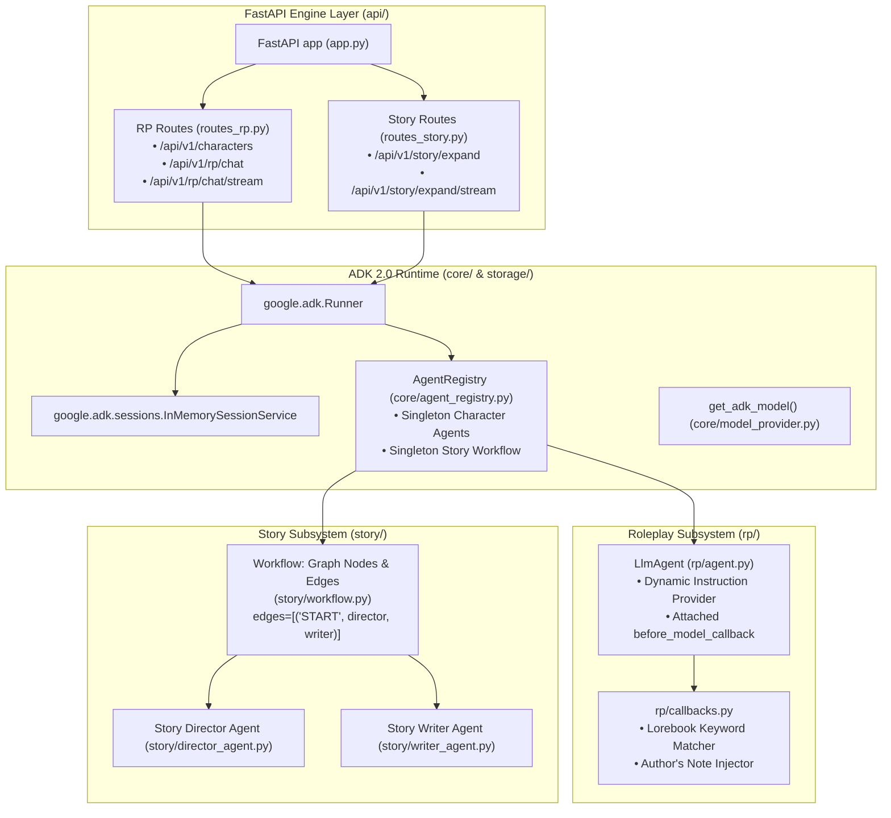

# Google ADK 2.0 Architecture Refactoring Design Document

**Date:** 2026-09-17  
**Status:** Proposed  
**Scope:** `src/story_rp_engine/` and `tests/story_rp_engine/`

---

## 1. Problem Statement & Audit

An audit of `src/story_rp_engine` identified critical architectural anti-patterns and sub-optimal implementations when measured against Google Agent Development Kit (ADK) 2.0 standards:

1. **Per-Turn Agent Instantiation (Lifecycle Violation):**
   - In RP mode (`api/routes_rp.py`), `create_rp_agent` is called on *every incoming request*, re-instantiating `LlmAgent` and re-validating configurations per turn.
   - In Story mode (`story/workflow.py`), `create_director_agent` and `create_writer_agent` are re-instantiated on *every expansion request*.
   - ADK expects agents and workflows to be long-lived, initialized once, and executed across turns using `Runner` and `SessionService`.

2. **Ad-Hoc Prompt Building vs Native Context/Callbacks:**
   - Conversation history is manually flattened into a raw text string (`f"{conversation_str}\nASSISTANT:"`) in `rp/prompt_builder.py`.
   - Lorebook entries and Author's Note steering directives are manually spliced into text templates.
   - ADK 2.0 provides `CallbackContext` / `ReadonlyContext`, `before_model_callback`, and dynamic instruction providers specifically to manage context injection cleanly without ad-hoc string munging.

3. **Sequential Execution via Manual Glue Code instead of Graph Workflow:**
   - In `story/workflow.py`, Director framing and Writer prose generation are sequentially wired together via manual function calls (`director.invoke` -> string parsing -> `build_writer_prompt` -> `writer.invoke`).
   - ADK 2.0 provides `Workflow` with declarative graph edges (`edges=[("START", director, writer)]`) as documented in [adk.dev/graphs/](https://adk.dev/graphs/).

4. **Critical Monkey-Patching in `core/agent_utils.py`:**
   - `core/agent_utils.py` attaches custom `.invoke()` and `.stream()` properties onto `google.adk.agents.LlmAgent` that call `litellm.completion()` directly.
   - This circumvents ADK's native `Runner`, `SessionService`, plugins, event telemetry, and lifecycle callbacks.

5. **Reinvented Session Storage:**
   - Chat history is manually stored in custom JSON files in `storage/store.py`, rather than utilizing ADK's native `SessionService` (`InMemorySessionService` / `DatabaseSessionService`).

6. **Synchronous Blocking Handlers & Artificial Streaming:**
   - FastAPI endpoints are synchronous (`def`) calling blocking `.invoke()` instead of `async def` streaming native ADK `Event` objects.
   - `stream_agent_response` implements fake token streaming via word-splitting when invoke is used.

---

## 2. Refactored Architecture



---

## 3. Detailed Component Designs

### 3.1 Agent Registry & Lifecycle Management (`core/agent_registry.py`)
- Maintains a thread-safe registry of `LlmAgent` and `Workflow` instances.
- **Character Agents:** Created **once** when a character is first loaded or referenced, using `create_rp_agent(card, config, lorebook=...)`. Cached in `AgentRegistry._rp_agents[char_id]`.
- **Story Workflow:** Instantiated **once** at startup via `create_story_workflow(config)` and stored as a singleton.
- **Session Management:** Backed by `google.adk.sessions.InMemorySessionService`. When a request arrives, `session_service.get_session(...)` or `session_service.create_session(...)` is invoked. Turn messages and session-scoped state (`char_id`, `authors_note`, `user_name`) live in `session.state`.

### 3.2 ADK Callbacks & Context Injection (`rp/callbacks.py`)
- Eliminates ad-hoc string concatenation functions (`build_rp_turn_prompt`).
- Uses `before_model_callback(callback_context: CallbackContext, llm_request: LlmRequest) -> Optional[LlmResponse]`:
  1. Inspects incoming user input from `callback_context` / `llm_request.contents`.
  2. Runs `LorebookEngine.match_entries()` against user input to find active lore.
  3. If active lore or `authors_note` (from `callback_context.state`) are present, injects them cleanly into `llm_request.config.system_instruction` or appends context without corrupting multi-turn conversation history.
- Uses dynamic instruction provider `rp_instruction_provider(context: ReadonlyContext) -> str` to format character persona, dialogue examples, and scenario using `context.state`.

### 3.3 Declarative Graph Workflow for Story Mode (`story/workflow.py`)
- Replaces manual function orchestration with `google.adk.Workflow`:
  ```python
  from google.adk import Agent, Workflow

  def create_story_workflow(config: EngineConfig) -> Workflow:
      director = create_director_agent(config)
      writer = create_writer_agent(config)
      return Workflow(
          name="story_workflow",
          edges=[
              ("START", director, writer)
          ],
      )
  ```
- Workflow nodes:
  - `director`: Consumes story request (premise, genre, tone, current text, user instruction) and outputs scene framing.
  - `writer`: Receives framing and context, producing the literary prose continuation.

### 3.4 Native Runner Execution & Removal of Monkey-Patching (`core/agent_utils.py`)
- Completely removes monkey-patched `LlmAgent.invoke` and `LlmAgent.stream`.
- Provides clean async helper functions for running agents via `Runner.run_async(...)`:
  - `async def run_agent_turn(...) -> str`: Consumes events until turn completion and returns final assistant text.
  - `async def stream_agent_events(...) -> AsyncIterator[str]`: Yields incremental token deltas from `Event.content`.

### 3.5 API Compatibility
- Endpoints in `api/routes_rp.py` and `api/routes_story.py` remain 100% backward-compatible in their HTTP request and response JSON schemas:
  - `POST /api/v1/rp/chat` -> `{"reply": "...", "session_id": "..."}`
  - `POST /api/v1/rp/chat/stream` -> Server-Sent Events stream (`data: ...\n\ndata: [DONE]\n\n`)
  - `POST /api/v1/story/expand` -> `{"expansion": "..."}`
  - `POST /api/v1/story/expand/stream` -> Server-Sent Events stream

---

## 4. Verification & Testing Strategy

- Unit tests for `AgentRegistry` verifying agents are created exactly once and cached.
- Unit tests for `rp/callbacks.py` verifying dynamic lorebook retrieval and author's note injection during `before_model_callback`.
- Unit tests for `story/workflow.py` verifying graph edges, node connections, and multi-agent execution.
- Integration tests for `api/routes_rp.py` and `api/routes_story.py` verifying non-streaming and SSE streaming endpoints against mock ADK models.
- Full regression test run with `pytest tests/story_rp_engine`.
